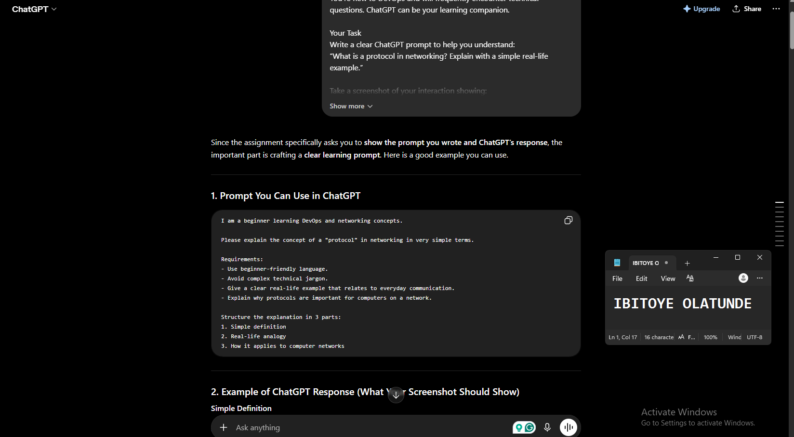
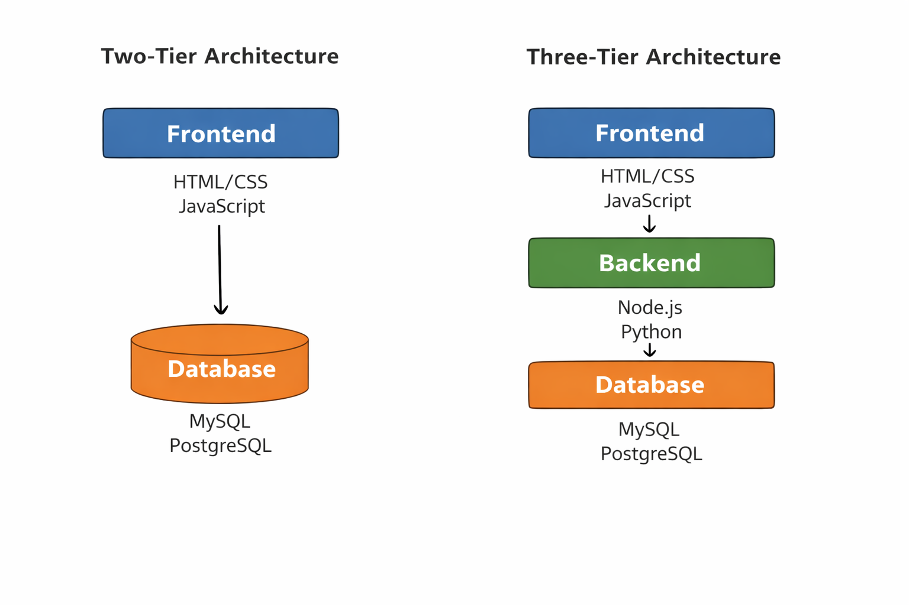
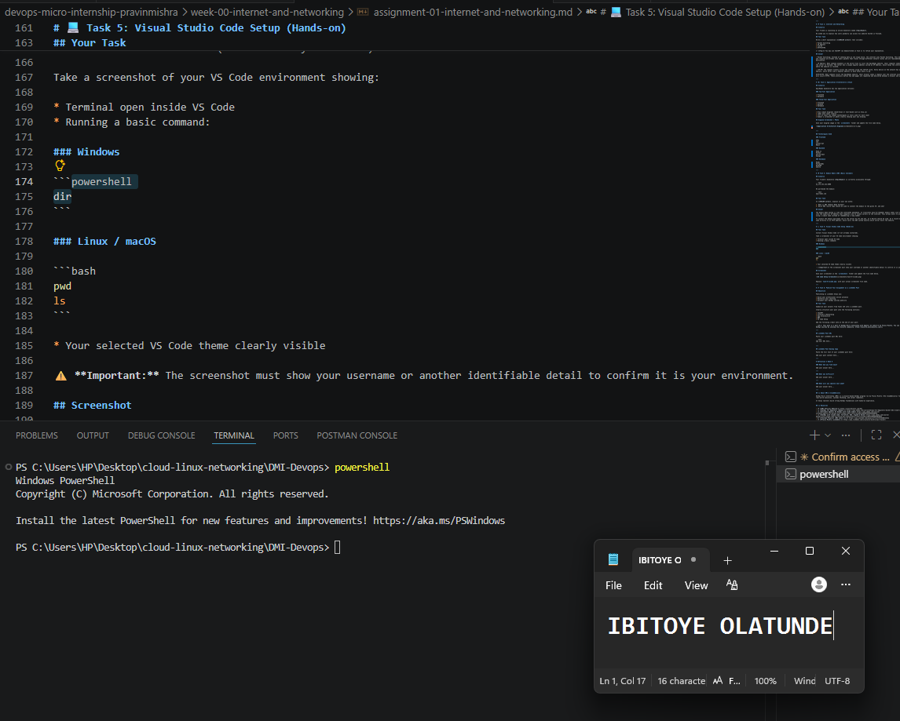

# Week 00 - Internet and Networking

Part of the DevOps Micro Internship (DMI) Cohort 3 with Agentic AI

---

# 🧑‍💻 Task 1: Using ChatGPT as Your Learning Assistant

## Scenario

You're new to DevOps and will frequently encounter technical questions. ChatGPT can be your learning companion.

## Your Task

Write a clear ChatGPT prompt to help you understand:

> "What is a protocol in networking? Explain with a simple real-life example."

Take a screenshot of your interaction showing:

* Your detailed prompt (with clear expectations)
* ChatGPT's simplified response with an example

## Screenshot

Save your screenshot in the `screenshots` folder and update the file name below.




---

## What I Learned (2–3 lines)

A protocol in networking is a set of rules that devices follow to communicate with each other over a network.
These rules tell computers how to send data, how to receive it, and how to understand it correctly.

---

# 🌐 Task 2: Internet and Networking

## Scenario

Your friend is launching an online bookstore named **EpicReads**.

He asked you to explain how users globally can access his website hosted in Finland.

## Your Task

Write a short explanation (**100–150 words**) that includes:

* Packet Switching
* IP Address
* TCP/IP
* HTTP/HTTPS

💡 **Tip:** You may use ChatGPT (as demonstrated in Task 1) to refine your explanation.

## Answer

- Packet Switching: Instead of sending data as one large block, the internet uses Packet Switching. This means the request and response are broken into small packets that travel through different network routes and are reassembled at their destination.

- IP Address: When someone anywhere in the world tries to visit the EpicReads website, their computer sends a request to the server in Finland. The server has a unique digital address called an IP Address, which helps the internet know exactly where the website is located.

- TCP/IP: The request travels across the internet using the TCP/IP suite. Every device on the network has a unique IP Address, which works like a digital address so data knows where to go.

HTTP/HTTPS: When someone visits the EpicReads website, their browser sends a request over the internet using HTTP or the more secure HTTPS. These protocols define how web pages are requested and delivered between a browser and a server.

---

# 🏗️ Task 3: Application Architecture & Stack

## Scenario

EpicReads bookstore has two application versions:

### Two-Tier Application

* Frontend
* Database

### Three-Tier Application

* Frontend
* Backend
* Database

## Your Task

* Draw simple diagrams (hand-drawn or tool-based such as draw.io)
* Label each layer clearly
* List at least two common technologies or tools used for each layer
* Submit a screenshot or photo clearly showing your own drawing

## Diagram Screenshot / Photo

Save your diagram image in the `screenshots` folder and update the file name below.




---

## Technologies Used

### Frontend

HTML
CSS
JavaScript
React

### Backend

Node.js
Python
Spring Boot
Django

### Database

MySQL
PostgreSQL
MongoDB
SQLite

---

# 🌍 Task 4: Domain Name & DNS (Basic Concepts)

## Scenario

Your friend's bookstore **EpicReads** is currently accessible through:

```text
52.172.142.222:3000
```

He purchased the domain:

```text
epicreads.com
```

## Your Task

In **50–100 words**, explain in your own words:

1. What is DNS (Domain Name System)?
2. Which DNS record type should be used to connect the domain to the given IP, and why?

## Answer

The Domain Name System is like the internet’s phonebook. It translates easy-to-remember domain names such as epicreads.com into the numerical IP Address that computers use to locate servers on the internet. This allows users to access a website using a simple name instead of remembering a long number.

To connect the domain epicreads.com to the server 52.172.142.222, an A Record should be used. An A record maps a domain name directly to an IPv4 address, which tells the DNS system exactly which server hosts the website.

---

# 💻 Task 5: Visual Studio Code Setup (Hands-on)

## Your Task

Install Visual Studio Code (if not already installed).

Take a screenshot of your VS Code environment showing:

* Terminal open inside VS Code
* Running a basic command:

### Windows

```powershell
dir
```

### Linux / macOS

```bash
pwd
ls
```

* Your selected VS Code theme clearly visible

⚠️ **Important:** The screenshot must show your username or another identifiable detail to confirm it is your environment.

## Screenshot

Save your screenshot in the `screenshots` folder and update the file name below.




---

# 🔗 Task 6: Publish Your Assignment as a LinkedIn Post

## Objective

Publishing on LinkedIn helps you:

* Build your professional online presence
* Reinforce your learning
* Document your DevOps journey publicly

## Your Task

Summarize your answers from Tasks 1–5 into a LinkedIn post.

Clearly structure your post into the following sections:

* ChatGPT
* Internet & Networking
* App Architecture
* DNS
* VS Code Setup

Add the following credit note at the end of your post:

> **P.S. This post is part of the DevOps Micro Internship (DMI) with Agentic AI — Cohort 3 — by Pravin Mishra. My graded progress is public: https://dmi.pravinmishra.com/s/YOUR-GITHUB-USERNAME.html · Start your DevOps journey: https://dmi.pravinmishra.com/?utm_source=student&utm_medium=ps-linkedin&utm_campaign=cohort3**

---

## LinkedIn Post URL

Paste your LinkedIn post URL here:

`https://www.linkedin.com/posts/olatunde-ibitoye_devops-learninginpublic-networking-activity-7484078480301735936-e0uK?utm_source=share&utm_medium=member_desktop&rcm=ACoAAB_xj1QBIy4RnDuKMoQp8yo4i8QCKxf266A`

---

## LinkedIn Post Backup Copy

Paste the full text of your LinkedIn post here:

🚀 My DevOps Learning Journey – Week 1

I’ve started diving into DevOps, and here’s a summary of what I’ve learned so far 👇

🔹 ChatGPT as a Learning Assistant
I’m using ChatGPT to break down complex concepts into simple explanations. For example, I learned that a protocol is just a set of rules devices follow to communicate—just like rules in a conversation.

🌐 Internet & Networking
The internet works like a global delivery system. Data is broken into small packets (packet switching), sent across networks using TCP/IP, and delivered to the correct destination using IP addresses. Protocols like HTTP/HTTPS help browsers communicate with servers.

🏗️ App Architecture
I explored two common architectures:

Two-tier: Frontend → Database
Three-tier: Frontend → Backend → Database

Each layer has its role:

Frontend: User interface (HTML, CSS, JavaScript)
Backend: Logic (Node.js, Python)
Database: Storage (MySQL, PostgreSQL)

🌍 DNS (Domain Name System)
DNS acts like the internet’s phonebook, converting domain names into IP addresses. To connect a domain to a server, we use an A record, which maps directly to the server’s IP.

💻 VS Code Setup
I set up my development environment using VS Code with essential extensions for productivity, debugging, and coding efficiency—laying the foundation for real-world DevOps workflows.

This is just the beginning, but I’m already seeing how everything connects—from how the internet works to how applications are structured.

#DevOps #LearningInPublic #Networking #WebDevelopment #TechJourney

P.S. This post is part of the FREE DevOps Micro Internship Cohort run by Pravin Mishra. You can start your DevOps journey for free from his YouTube Playlist.

---

# Reflection – Week 0

### What did you find easy?

I found it easy to understand basic networking concepts when explained with real-life analogies.

---

### What was difficult?

What was a bit challenging was connecting all the pieces together (like TCP/IP, DNS, and architecture) into one clear flow.

---

### What will you improve next week?

Next week, I want to improve by doing more hands-on practice and building small projects to reinforce these concepts.

---

## 📌 About DMI & CloudAdvisory

DevOps Micro Internship (DMI) is a project-based DevOps program run by Pravin Mishra (The CloudAdvisory) focused on real-world execution, systems thinking, and career readiness.

It helps learners build strong DevOps foundations with hands-on experience.


## 📌 Resources

- 🌐 **DMI Official Website:** https://pravinmishra.com/dmi  
- 🎓 **DevOps for Beginners (Udemy):** https://www.udemy.com/course/devops-for-beginners-docker-k8s-cloud-cicd-4-projects/  
- 🎓 **Ultimate Agentic AI DevOps with Clude Code** https://www.udemy.com/course/ultimate-agentic-ai-devops-with-claude-code/?referralCode=448389767BC96284087B
- 🎓 **DevOps with Claude Code: Terraform, EKS, ArgoCD & Helm** https://www.udemy.com/course/devops-with-claude-code-terraform-eks-argocd-helm/?referralCode=1C5B734505D65A010FA3
- ▶️ **YouTube Playlist (DMI Cohort 3):** https://www.youtube.com/playlist?list=PLFeSNDtI4Cho  
- 🔗 **Pravin Mishra (LinkedIn):** https://www.linkedin.com/in/pravin-mishra-aws-trainer/  
- 🏢 **CloudAdvisory (LinkedIn):** https://www.linkedin.com/company/thecloudadvisory/

---

*This submission is part of DevOps Micro Internship (DMI) Cohort 3 — Agentic AI Track*