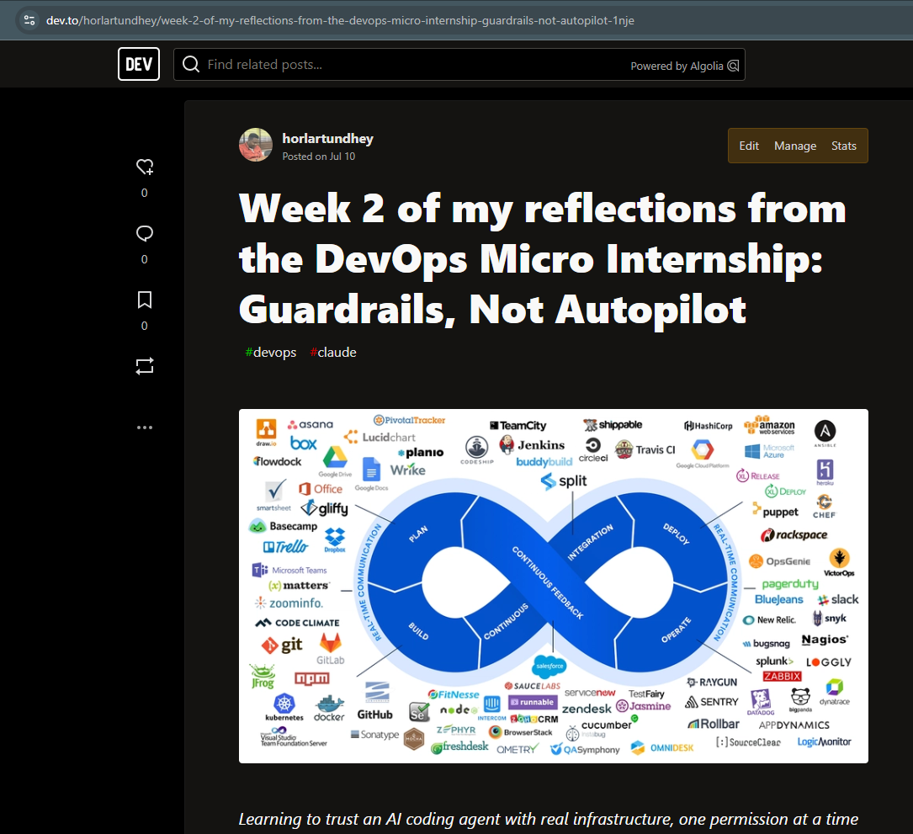
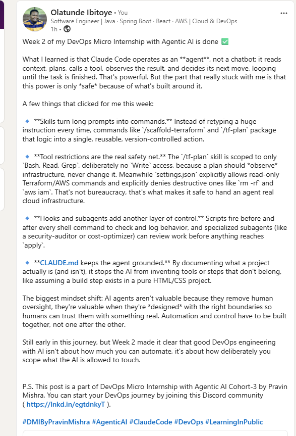

# Assignment 8 — Week 2 Reflection Blog

Part of the DevOps Micro Internship (DMI) Cohort 3 with Agentic AI

---

# Purpose

In this assignment, you will reflect on your Week 2 learning journey and write a short blog capturing your experience working with Agentic AI tools such as Claude Code, Skills, Subagents, MCP, Hooks, Permissions, and Memory.

You will also publish a LinkedIn post summarizing your learning and share both links for evaluation.

---

# Task 1 — Write Your Reflection Blog

## Goal

Write a reflection blog covering your Week 2 learning experience.

### Blog Requirements

Your blog must include:

* Title: **Reflection – Week 2**
* Minimum 300 words
* At least 2–3 topics from Week 2 (Claude Code, Skills, Subagents, MCP, Hooks, Permissions, Memory)
* Honest personal reflection (learning, challenges, mindset)
* One habit/system you plan to implement
* Your full name clearly visible

### Allowed Platforms

You can publish your blog on:

* Hashnode
* Medium
* Dev.to
* LinkedIn Article
* GitHub Markdown file
* Substack

---

### Evidence

#### Screenshot 1 — Blog published and visible



---

### Submission Field

Blog Link:

`https://dev.to/horlartundhey/week-2-of-my-reflections-from-the-devops-micro-internship-guardrails-not-autopilot-1nje`

---

# Task 2 — Create LinkedIn Post

## Goal

Share your Week 2 learning publicly on LinkedIn.

---

### LinkedIn Post Requirements

Your post must include:

* One screenshot from any Week 2 assignment
* Short reflection (what you learned or built)
* Required P.S. line exactly as given below

---

### Required P.S. Line (Must Include Exactly)

> **P.S. This post is a part of DevOps Micro Internship with Agentic AI Cohort-3 by [Pravin Mishra](https://www.linkedin.com/in/pravin-mishra-aws-trainer/). You can start your DevOps journey by joining [DMI waiting list](https://forms.gle/3hvrWJBDzsDeJoPs6) (https://forms.gle/3hvrWJBDzsDeJoPs6).**

---

### Suggested Hashtags

#DMIByPravinMishra #AgenticAI #ClaudeCode #DevOps #LearningInPublic

---

### Evidence

#### Screenshot 2 — LinkedIn post published



---

### Submission Field

LinkedIn Post Content (copy-paste here):

```
Week 2 of my DevOps Micro Internship with Agentic AI is done ✅

What I learned is that Claude Code operates as an **agent**, not a chatbot: it reads context, plans, calls a tool, observes the result, and decides its next move, looping until the task is finished. That's powerful. But the part that really stuck with me is that this power is only *safe* because of what's built around it.

A few things that clicked for me this week:

🔹 **Skills turn long prompts into commands.** Instead of retyping a huge instruction every time, commands like `/scaffold-terraform` and `/tf-plan` package that logic into a single, reusable, version-controlled action.

🔹 **Tool restrictions are the real safety net.** The `/tf-plan` skill is scoped to only `Bash, Read, Grep`, deliberately no `Write` access, because a plan should *observe* infrastructure, never change it. Meanwhile `settings.json` explicitly allows read-only Terraform/AWS commands and explicitly denies destructive ones like `rm -rf` and `aws iam`. That's not bureaucracy, that's what makes it safe to hand an agent real cloud infrastructure.

🔹 **Hooks and subagents add another layer of control.** Scripts fire before and after every shell command to check and log behavior, and specialized subagents (like a security-auditor or cost-optimizer) can review work before anything reaches `apply`.

🔹 **CLAUDE.md keeps the agent grounded.** By documenting what a project actually is (and isn't), it stops the AI from inventing tools or steps that don't belong, like assuming a build step exists in a pure HTML/CSS project.

The biggest mindset shift: AI agents aren't valuable because they remove human oversight, they're valuable when they're *designed* with the right boundaries so humans can trust them with something real. Automation and control have to be built together, not one after the other.

Still early in this journey, but Week 2 made it clear that good DevOps engineering with AI isn't about how much you can automate, it's about how deliberately you scope what the AI is allowed to touch.


P.S. This post is a part of DevOps Micro Internship with Agentic AI Cohort-3 by Pravin Mishra. You can start your DevOps journey by joining this Discord community ( https://lnkd.in/egtdnkyT ).

#DMIByPravinMishra #AgenticAI #ClaudeCode #DevOps #LearningInPublic
```

---

### LinkedIn Post Link:

`https://www.linkedin.com/posts/olatunde-ibitoye_join-the-dmi-devops-micro-internship-share-7481344576662876160-hc4O/?utm_source=share&utm_medium=member_desktop&rcm=ACoAAB_xj1QBIy4RnDuKMoQp8yo4i8QCKxf266A`

---

# Submission Instructions

* Blog must be publicly accessible
* LinkedIn post must be visible (public or unlisted where applicable)
* All required fields must be filled
* Screenshot proofs must be added to GitHub repository
* Do not include sensitive information in blog or post

---

# Completion Checklist

* [ ] Blog written with required structure
* [ ] Blog includes at least 2–3 Week 2 topics
* [ ] Blog is publicly accessible
* [ ] LinkedIn post created
* [ ] Required P.S. line included
* [ ] LinkedIn post content copied in submission field
* [ ] Blog link added
* [ ] LinkedIn post link added
* [ ] Screenshots added to GitHub repo

---

# About DMI & CloudAdvisory

DevOps Micro Internship (DMI) is a project-based DevOps program run by Pravin Mishra (The CloudAdvisory), focused on real-world execution, systems thinking, and agentic AI workflows.

It helps learners build strong DevOps foundations through hands-on experience.

---

# Resources

* 🌐 DMI Official Website: [https://pravinmishra.com/dmi](https://pravinmishra.com/dmi)
* 🎓 DevOps for Beginners (Udemy): [https://www.udemy.com/course/devops-for-beginners-docker-k8s-cloud-cicd-4-projects/](https://www.udemy.com/course/devops-for-beginners-docker-k8s-cloud-cicd-4-projects/)
* 🎓 Agentic AI DevOps with Claude Code: [https://www.udemy.com/course/ultimate-agentic-ai-devops-with-claude-code/](https://www.udemy.com/course/ultimate-agentic-ai-devops-with-claude-code/)
* 🎓 DevOps with Claude Code: Terraform, EKS, ArgoCD & Helm: [https://www.udemy.com/course/devops-with-claude-code-terraform-eks-argocd-helm/](https://www.udemy.com/course/devops-with-claude-code-terraform-eks-argocd-helm/)
* ▶️ YouTube Playlist: [https://www.youtube.com/playlist?list=PLFeSNDtI4Cho](https://www.youtube.com/playlist?list=PLFeSNDtI4Cho)
* 🔗 Pravin Mishra (LinkedIn): [https://www.linkedin.com/in/pravin-mishra-aws-trainer/](https://www.linkedin.com/in/pravin-mishra-aws-trainer/)
* 🏢 CloudAdvisory (LinkedIn): [https://www.linkedin.com/company/thecloudadvisory/](https://www.linkedin.com/company/thecloudadvisory/)

