# Assignment 3 — Production Maintenance Drill (OPS Checklist)

Part of the DevOps Micro Internship (DMI) Cohort 3 with Agentic AI

---

## Purpose

In this assignment, you will treat your already deployed React application (on Ubuntu VM with Nginx) as a live production system. You will perform structured operational checks covering network validation, service health, log analysis, resource monitoring, configuration verification, and incident simulation with recovery — mirroring real on-call DevOps responsibilities.

---

# Task 1 — Server Access & Networking Validation

## Goal

Verify that the deployed React application is reachable from the browser and confirm basic network connectivity of the Ubuntu VM.

### Evidence

#### Screenshot 1 — Browser showing the React app with your Full Name visible on the UI

---

#### Screenshot 2 — Output of `ip a`

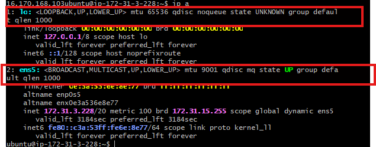

---

#### Screenshot 3 — Output of `sudo ss -tulpen`

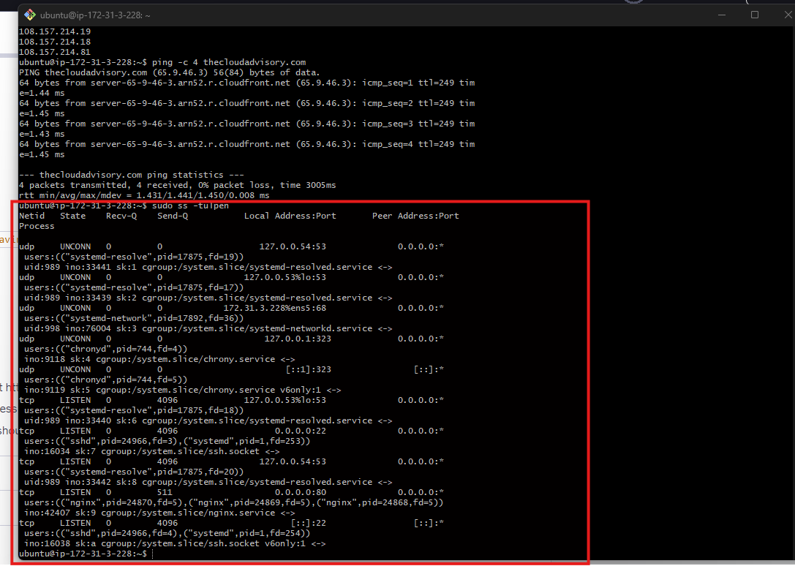

---

#### Screenshot 4 — Output of `sudo ufw status`

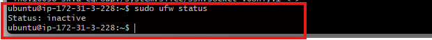

---

### Notes

Answer the following in your own words:

**1. What proves Nginx is listening on 0.0.0.0:80?**

The sudo ss -tulpen output shows a line indicating that Nginx is listening on 0.0.0.0:80. The 0.0.0.0 address means Nginx is bound to all network interfaces on the server, allowing it to accept HTTP connections from external clients. The presence of nginx in the process information confirms that Nginx is the service using port 80.

---

**2. What proves SSH is active on port 22?**

The same sudo ss -tulpen output shows a separate line for port 22, listening on 0.0.0.0:22 with sshd identified in the process information. This confirms that the SSH daemon is running and bound to all network interfaces, so the server accepts SSH connections from external clients on the standard port used for remote administration.

---

**3. Did you find any unexpected open ports? Explain briefly.**

No unexpected externally accessible ports were found. Apart from the intended services, Nginx on port 80 and SSH on port 22,the other listening services were associated with system services such as chronyd for time synchronization and systemd-resolved for DNS resolution. These services were bound to local loopback addresses such as 127.0.0.1 and 127.0.0.53, meaning they were not directly exposed to external internet traffic. Therefore, the server's externally accessible services were limited to the expected HTTP and SSH services.

---

# Task 2 — Service Health & Systemd Validation (Nginx)

## Goal

Verify that Nginx is properly installed, running, enabled at boot, and safely configured.

### Evidence

#### Screenshot 1 — Output of `systemctl status nginx --no-pager`

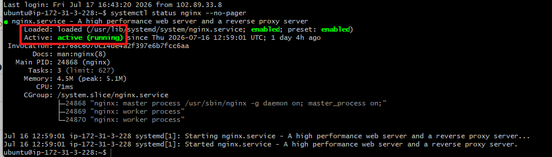

---

#### Screenshot 2 — Output of `sudo nginx -t`

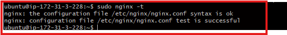

---

#### Screenshot 3 — Output of `sudo ss -lptn '( sport = :80 )'`

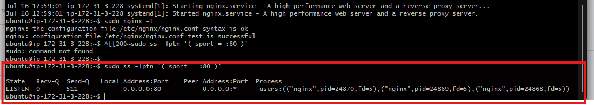

---

### Notes

Answer the following in your own words:

**1. What happens if Nginx fails to restart in production?**

If Nginx fails to restart, the website may become unavailable because Nginx is responsible for serving HTTP traffic on port 80. Users may experience connection errors, timeouts, or an inability to access the application. This can happen when there is a configuration error, a port conflict, or another issue with the server. Manual intervention may then be required to identify and resolve the problem.

---

**2. What's your basic rollback plan?**

Before applying any Nginx configuration change, I would first run sudo nginx -t to validate the configuration syntax. I would also keep a backup of the last known-good configuration file before making changes.

If the restart fails, I would check the service status using systemctl status nginx --no-pager and review the logs with sudo journalctl -u nginx --no-pager -n 50. If the issue is caused by the new configuration, I would restore the previous working configuration, run sudo nginx -t again, and then restart Nginx.

This provides a simple rollback process that helps restore the service quickly while the faulty change is investigated.

---

# Task 3 — Logs & Request Trace

## Goal

Verify real traffic flow and analyze logs to understand system behavior and errors.

### Evidence

#### Screenshot 1 — Output of `sudo tail -n 30 /var/log/nginx/access.log`

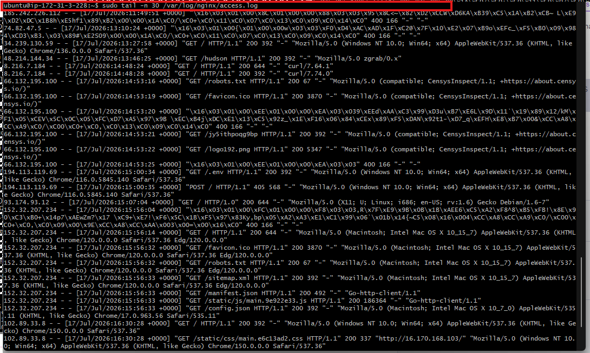

---

#### Screenshot 2 — Output of `sudo tail -n 30 /var/log/nginx/error.log`

---

#### Screenshot 3 — Output of `sudo journalctl -u nginx --no-pager -n 50`

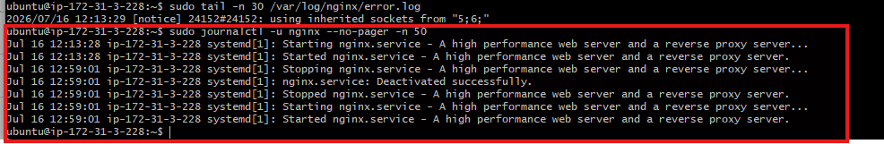

---

### Notes

Answer the following in your own words:

**1. Were there any errors in the logs?**

- If yes, mention 1–2 example error lines from the logs and explain what each one means in simple terms.
- If no, explain what it means if the error log is empty or shows no recent errors during your check.

No errors were found in the logs that were checked. 
The Nginx error log returned no output, and the journalctl entries showed only successful service events such as Nginx being started, stopped, reloaded, and deactivated successfully. There were no failed service events or error messages recorded during the period examined.

---

**2. If there were no errors, what does that indicate about the system?**

An empty error log and clean journalctl output indicate that Nginx did not record any internal errors, configuration problems, or failed service operations during the time period that was analyzed.

However, this does not mean the system is permanently error-free. It only means that no issues were recorded during the specific period covered by the logs that were checked. New problems could occur later due to configuration changes, increased traffic, or other system conditions, so logs should be monitored regularly.

---

**3. Based on the access logs, were your curl requests visible in the log entries? What does that prove about traffic flow?**

Yes. The curl requests appeared in the Nginx access.log entries as GET / requests with a successful 200 status code and the user agent identified as curl/8.18.0.

This confirms that the requests successfully reached the server, were received and processed by Nginx, and received a valid response. The fact that the requests were recorded in the access logs proves that traffic successfully flowed from the client to the server and through Nginx.

---

# Task 4 — System Resource Health Check (Capacity Red Flags)

## Goal

Assess server capacity and detect potential performance or failure risks.

### Evidence

#### Screenshot 1 — Output of `uptime`

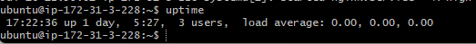

---

#### Screenshot 2 — Output of `free -h`

---

#### Screenshot 3 — Output of `df -h`

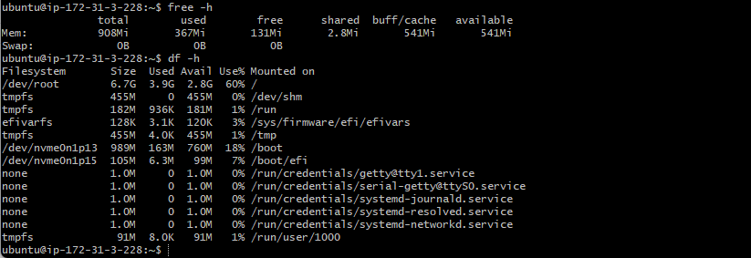

---

#### Screenshot 4 — Output of `sudo du -sh /var/* | sort -h`

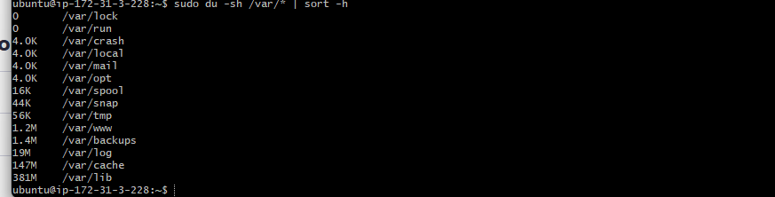

---

### Notes

Answer the following in your own words:

**1. Which resource looks most critical right now? (CPU/load, memory, or disk) Explain why.**

None of the three resources show a critical issue at the moment. CPU usage is low and the system is mostly idle. Memory usage also appears healthy, with sufficient available memory and no swap pressure. Disk usage is currently at 61%, which is still within a comfortable range.

If one resource had to be monitored most closely as the server grows, it would be disk usage. Disk space can gradually increase over time due to growing log files, application data, backups, and package caches. Unlike CPU or memory pressure, disk usage can sometimes increase quietly until the server suddenly runs out of space.

---

**2. What happens if disk becomes 100% full in a production server?**

When a production server's disk becomes completely full, many important operations can begin to fail.

Logs may stop writing: The server and applications may be unable to record new log entries. This is particularly dangerous during an incident because the logs needed to investigate the problem may not be created.
Applications may fail: Applications may need disk space for temporary files, uploads, caches, builds, or other operations. If no space is available, these operations can fail and applications may crash or become unusable.
Databases may have problems: A database may be unable to write new data or complete transactions. In serious cases, this can lead to service disruption or data integrity issues.
The server may become unstable: Critical system processes may fail because they cannot create or update required files. In severe cases, even basic operations such as logging in through SSH may stop working.

---

# Task 5 — Configuration & Deployment Verification

## Goal

Ensure the correct React build is deployed and Nginx is serving it properly.

### Evidence

#### Screenshot 1 — Output of `ls -lah /var/www/html | head -n 20`

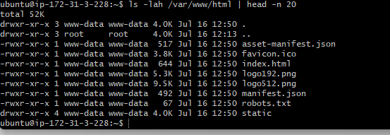

---

#### Screenshot 2 — Output of `grep -R "Deployed by" -n /var/www/html 2>/dev/null | head`

---

#### Screenshot 3 — Output of `grep -n "try_files" /etc/nginx/sites-available/default`

---

### Notes

Answer the following in your own words:

**1. How do you confirm that the correct version of the application is deployed?**

Deployment correctness was verified through a series of checks rather than relying on a single command.

First, I used ls -lah /var/www/html to inspect the application files in the web root. This confirmed that a genuine production build of the React application was present, including index.html, the static/ folder containing the compiled JavaScript and CSS bundles, and other standard build files. The files were owned by www-data, which is the user used by Nginx worker processes.

Next, I searched the deployed files for the custom identifying text, "Deployed by <Your Name>". This confirmed that the custom change was present in the compiled JavaScript bundle and matched the original source through the accompanying source map. This provided evidence that the exact expected build had been deployed rather than an old or generic version.

I also checked the Nginx configuration and confirmed that the correct web root was being used. The try_files configuration was verified to fall back to index.html, which is important for ensuring that the React single-page application handles routes correctly.

Finally, I validated the deployment through an HTTP request and by loading the application in a browser. The server returned the expected index.html content, confirming that the files on disk were actually being served to users.

Therefore, I confirmed the deployment through multiple layers: verifying the files in /var/www/html, confirming the React build files and custom change, checking that Nginx was serving the correct web root, and validating that the application loaded correctly in the browser.

---

# Task 6 — Nginx Configuration Failure Simulation

## Goal

Simulate a real-world Nginx misconfiguration and recover the service safely.

### Evidence

#### Screenshot 1 — Output of `sudo nginx -t` showing the syntax error (broken config)

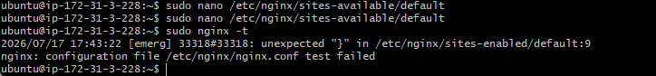

---

#### Screenshot 2 — Output of `sudo nginx -t` showing syntax ok (fixed config)

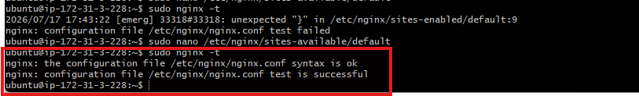

---

#### Screenshot 3 — Output of `curl -I http://<public-ip>` confirming recovery (200 OK)

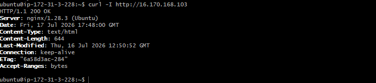

---

### Notes

Answer the following in your own words:

**1. What caused the configuration failure?**

The configuration failure was caused by two missing semicolons in /etc/nginx/sites-available/default.

One semicolon had been intentionally removed from the try_files $uri /index.html; directive as part of the task. A second missing semicolon was also found in the error_page 404 /index.html; directive. Since Nginx configuration directives require correct syntax, either missing semicolon could cause Nginx's configuration parser to fail when reading the server block.

As a result, Nginx reported a syntax error and could not safely load the configuration.

---

**2. How did you fix the issue?**

I reopened the Nginx configuration file and restored both missing semicolons. I then ran:

sudo nginx -t

This validated the configuration syntax before any service restart was performed. After receiving confirmation that the syntax was valid and the configuration test was successful, I restarted Nginx using:

sudo systemctl restart nginx

Finally, I performed an external curl -I check to confirm that the application was being served correctly again.

---

**3. How can you avoid this kind of issue in real production systems?**

Several practices can help prevent configuration errors in production:

- Always run nginx -t after making any Nginx configuration change and before restarting or reloading the service.
- Keep Nginx configuration files in version control, such as Git, so incorrect changes can quickly be reverted to a known-good version.
- Test configuration changes in a staging environment before applying them to production.
- Automate configuration validation in the deployment pipeline so syntax errors are detected during CI/CD and prevented from reaching the live server.

These practices reduce the risk of configuration mistakes causing production downtime.

---

# Task 7 — Web Application Failure Simulation

## Goal

Simulate missing deployment content and recover the application safely.

### Evidence

#### Screenshot 1 — Output of `curl -I http://<public-ip>` showing failure (non-200 response)

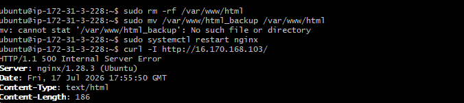

---

#### Screenshot 2 — Output of `curl -I http://<public-ip>` confirming recovery (200 OK)

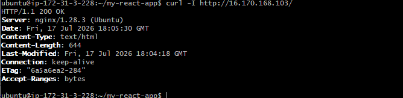

---

### Notes

Answer the following in your own words:

**1. What caused the application to break in this scenario?**

The application broke because the web root directory, /var/www/html, was emptied of its deployment files. This is the exact directory from which Nginx serves the application.

Although Nginx itself remained running and its configuration was still correct, there was no application content available to serve. Because the required files, including the React application's index.html, were missing, the server returned a 500 Internal Server Error instead of displaying the application.

---

**2. How did you fix the issue and restore the application?**

The original deployment had been safely backed up beforehand by moving it to html_backup instead of permanently deleting it. To restore the application, I removed the empty, broken web root directory and moved the backup back into its correct location at /var/www/html.

I then restarted Nginx to ensure it was serving the restored files correctly. Recovery was confirmed externally using curl -I, which returned a 200 OK response.

The response also matched the pre-incident deployment metadata, including the Content-Length, Last-Modified, and ETag values. This confirmed that the exact same application build had been successfully restored.

---

**3. What steps would you take to prevent this kind of issue in real production systems?**

To prevent similar incidents in production, I would:

- Create automated backups before every deployment so that releases can be quickly rolled back.
- Deploy each release to a separate, versioned directory and use an atomic symlink switch, such as /var/www/current, instead of overwriting the live directory directly.
- Add CI/CD checks to confirm that a deployment completed successfully and that required files, such as a non-empty index.html, exist before marking the deployment as successful.
- Use post-deployment health checks and monitoring to automatically verify that the live application returns a healthy 200 OK response after every deployment.

These practices help prevent a deployment from leaving the live web root empty or incomplete and allow failures to be detected and recovered from quickly.

---

# Task 8 — Security & Reliability Review

## Goal

Review and reflect on the security and reliability practices applied during this assignment.

### Security & Reliability Notes

Answer the following in your own words:

**1. Why is SSH key-based authentication more secure than sharing passwords?**

SSH key-based authentication is generally more secure than sharing passwords because it uses a cryptographic key pair: a private key and a public key. The private key remains securely with the user and is not shared with the server or other people. The server only stores the public key.

This makes it much harder for attackers to gain access through password guessing or brute-force attacks. It also avoids the risks associated with sharing, reusing, or accidentally exposing passwords. The private key should still be protected carefully, preferably with a passphrase.

---

**2. Why should only required ports be open on a production server?**

Only the ports required by the application and its services should be open because every open port can potentially provide an entry point for attackers.

For example, a web server may need ports 80 and 443 for HTTP and HTTPS traffic, while SSH may require port 22 for administration. Unnecessary open ports increase the server's attack surface and could expose vulnerable or misconfigured services.

A smaller attack surface makes the server easier to secure and monitor.

---

**3. Why is it important for Nginx to be enabled on boot?**

Nginx should be enabled to start automatically when the server boots so that the website or application becomes available again after a restart, reboot, or unexpected recovery.

Without this configuration, the server may come back online while Nginx remains stopped, causing the application to appear offline even though the server itself is running. Enabling Nginx on boot improves service reliability and reduces the need for manual intervention.

---

**4. What are the risks of sharing secrets, keys, or credentials publicly?**

Publicly exposing secrets, SSH private keys, API keys, passwords, database credentials, or cloud access keys can allow unauthorized people to access systems and services.

An exposed credential could be used to access servers, steal or modify data, deploy malicious code, abuse cloud resources, or generate unexpected charges. Even if a secret is removed later, it may already have been copied or stored elsewhere.

For this reason, secrets should never be committed to public repositories, posted in screenshots, or shared in public chats. If a secret is accidentally exposed, it should be revoked or rotated immediately.

---

**5. Why should cloud resources be stopped or terminated when they are no longer needed?**

Cloud resources should be stopped or terminated when they are no longer needed to reduce unnecessary costs and security risks.

Running servers, databases, and other resources can continue generating charges even when they are not actively being used. Unused resources can also become forgotten and remain unpatched or misconfigured, creating potential security vulnerabilities.

Properly shutting down or removing unused resources helps control cloud spending, reduces the attack surface, and keeps the infrastructure easier to manage.

---

# LinkedIn Post (Required)

## Evidence

#### LinkedIn Post URL

Paste your LinkedIn post URL here:

`https://www.linkedin.com/posts/olatunde-ibitoye_devops-cloudengineering-linux-ugcPost-7483948703381270529-IsOW/?utm_source=share&utm_medium=member_desktop&rcm=ACoAAB_xj1QBIy4RnDuKMoQp8yo4i8QCKxf266A`

---

#### Screenshot — Published LinkedIn post

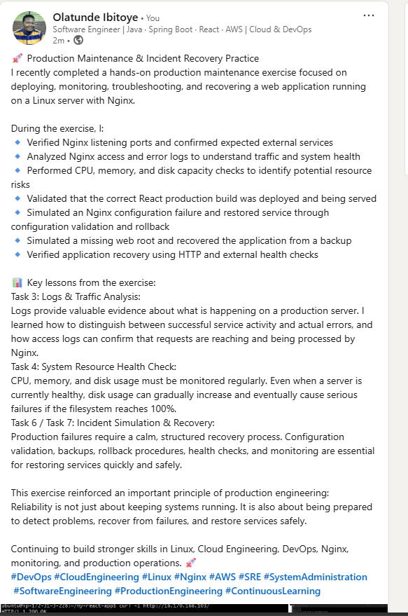

---

# Submission Instructions

- Add all required screenshots in your submission
- Full name must be visible in required screenshots
- Do not expose sensitive information (keys, passwords, account IDs)

---

# Completion Checklist

- [ ] Task 1: Screenshots (browser, ip a, ss -tulpen, ufw status) + Notes answered
- [ ] Task 2: Screenshots (nginx status, nginx -t, ss port 80) + Notes answered
- [ ] Task 3: Screenshots (access log, error log, journalctl) + Notes answered
- [ ] Task 4: Screenshots (uptime, free -h, df -h, du -sh) + Notes answered
- [ ] Task 5: Screenshots (ls html, grep deployed by, grep try_files) + Notes answered
- [ ] Task 6: Screenshots (nginx -t fail, nginx -t pass, curl recovery) + Notes answered
- [ ] Task 7: Screenshots (curl failure, curl recovery) + Notes answered
- [ ] Task 8: Security & Reliability Notes answered
- [ ] LinkedIn post published and URL submitted
- [ ] Full Name visible in all required screenshots
- [ ] No sensitive data exposed

---

## 📌 About DMI & CloudAdvisory

DevOps Micro Internship (DMI) is a project-based DevOps program run by Pravin Mishra (The CloudAdvisory) focused on real-world execution, systems thinking, and career readiness.

It helps learners build strong DevOps foundations with hands-on experience.

---

## 📌 Resources

- 🌐 DMI Official Website: https://pravinmishra.com/dmi  
- 🎓 DevOps for Beginners (Udemy): https://www.udemy.com/course/devops-for-beginners-docker-k8s-cloud-cicd-4-projects/  
- 🎓 Agentic AI DevOps with Claude Code: https://www.udemy.com/course/ultimate-agentic-ai-devops-with-claude-code/  
- 🎓 DevOps with Claude Code: Terraform, EKS, ArgoCD & Helm: https://www.udemy.com/course/devops-with-claude-code-terraform-eks-argocd-helm/  
- ▶️ YouTube Playlist: https://www.youtube.com/playlist?list=PLFeSNDtI4Cho  
- 🔗 Pravin Mishra (LinkedIn): https://www.linkedin.com/in/pravin-mishra-aws-trainer/  
- 🏢 CloudAdvisory (LinkedIn): https://www.linkedin.com/company/thecloudadvisory/

---

*This submission is part of DevOps Micro Internship (DMI) Cohort 3 — Agentic AI Track.*