# Assignment 5 — Bash Script Automation Drill (OPS Checklist)

Part of the DevOps Micro Internship (DMI) Cohort 3 with Agentic AI

---

## Purpose

In this assignment, you will practice Bash scripting by building a series of small automation scripts covering environment setup, variables, arrays, loops, file conditionals, if-else logic, and functions. These scripts form the foundation of real-world Linux automation used in DevOps, cloud, and production support environments.

---

# Task 1 — Bash Environment & Workspace Setup

## Goal

Verify that Bash is available on your system and create a clean workspace for this assignment.

### Evidence

#### Screenshot 1 — Output of `echo $SHELL` and `bash --version`

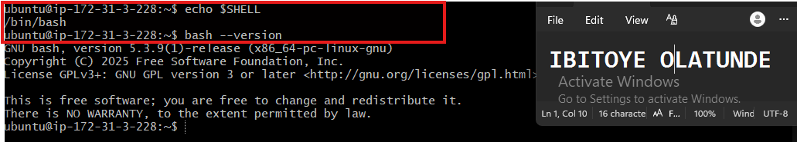

---

#### Screenshot 2 — Output of `pwd` and `ls -lah` showing the scripts directory

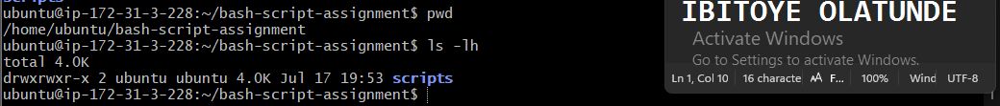

---

### Notes

Answer the following in your own words:

**1. What is Bash?**

Bash stands for Bourne Again Shell. It is both a command-line shell and a scripting language. Bash interprets commands entered by a user or stored in a script and instructs the operating system to perform the requested operations.

Bash is one of the most commonly used shells on Linux systems and is widely used for system administration, automation, and DevOps tasks.

---

**2. What is the difference between shell and Bash?**

A shell is a program that provides an interface for interacting with an operating system through commands. It allows users to execute programs and perform system operations.

Bash is one specific type of shell. Other examples include sh, zsh, ksh, and fish.

Although different shells perform similar core functions, they can differ in their syntax, features, configuration files, and scripting capabilities.

---

**3. Why is it important to confirm the Bash version before writing scripts?**

Confirming the Bash version verifies that Bash is installed and identifies the specific version available on the system.

This is important because different Bash versions may support different syntax, commands, and features. Checking the version before writing a script helps ensure that the features and syntax used are compatible with the target environment and reduces the risk of unexpected errors when the script runs.

---

# Task 2 — Your First Bash Script

## Goal

Create your first Bash script, make it executable, and run it from the terminal.

### Evidence

#### Screenshot 1 — Content of `first-script.sh`

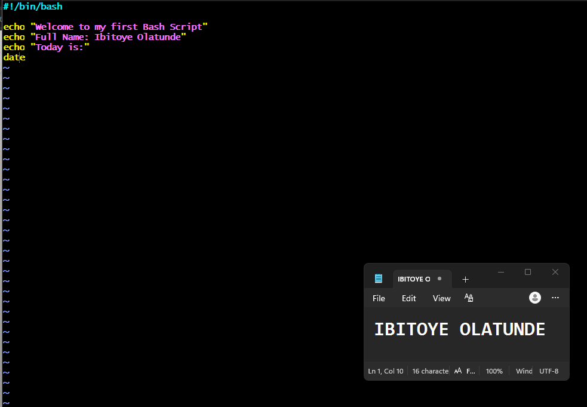

---

#### Screenshot 2 — Output of `./first-script.sh`

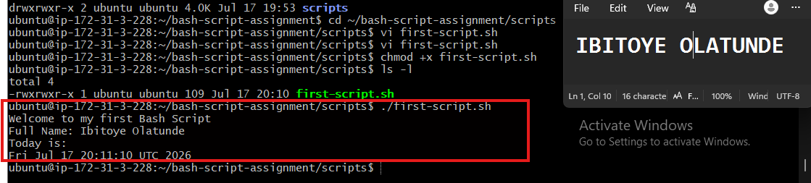

---

#### Screenshot 3 — Output of `ls -l first-script.sh` showing executable permission

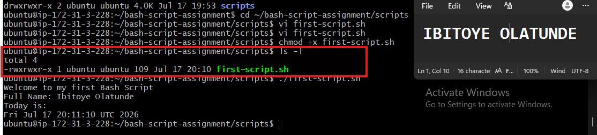

---

### Notes

Answer the following in your own words:

**1. What is the purpose of `#!/bin/bash`?**

`#!/bin/bash` is called the shebang line. It tells the operating system which interpreter should be used to execute the script.

In this case, it instructs the system to use the Bash interpreter to run the commands contained in the script.

---

**2. Why do we use `chmod +x` before running a script?**

A newly created script may not have execute permission by default. The command:

`chmod +x` script.sh

adds execute permission to the file.

This allows the script to be executed directly using:

`./script.sh`

Without execute permission, the system will usually return a Permission denied error when you try to run the script directly.

---

**3. What is the difference between running a script using `./script.sh` and `bash script.sh`?**

When running:

`./script.sh`

the system executes the script file directly. The file must have execute permission, and the shebang line determines which interpreter should be used to run it.

When running:

`bash script.sh`

you are explicitly telling Bash to read and execute the script. The script does not need execute permission for this method, and Bash is used regardless of which interpreter is specified in the shebang line.

---

# Task 3 — Variables: User Information Script

## Goal

Use variables to store and display user-related information.

### Evidence

#### Screenshot 1 — Content of `user-info.sh`

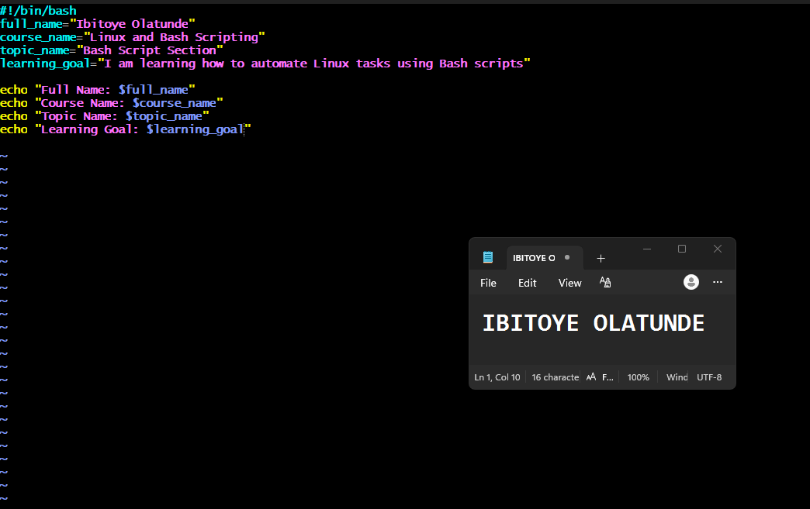

---

#### Screenshot 2 — Output of `./user-info.sh`

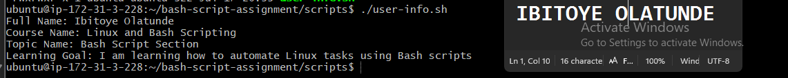

---

### Notes

Answer the following in your own words:

**1. What is a variable in Bash?**

A variable in Bash is a name used to store a value that can be used later in a script.

For example, we can store a course name in a variable:

course_name="Linux and Bash Scripting"

The value stored in course_name can then be accessed whenever it is needed in the script.

---

**2. Why should we avoid spaces around the `=` sign when creating variables?**

Bash does not allow spaces around the = sign during variable assignment.

The correct format is:

course_name="Linux and Bash Scripting"

The incorrect format is:

course_name = "Linux and Bash Scripting"

Bash interprets the second example as a command rather than a variable assignment. It may treat course_name as a command, while = and "Linux and Bash Scripting" are interpreted as arguments.

Therefore, there must be no spaces around the = sign when assigning a value to a Bash variable.

---

**3. How do you access the value stored inside a Bash variable?**

The $ symbol is placed before the variable name to access the value stored inside it.

For example:

echo "$course_name"

If the variable contains "Linux and Bash Scripting", the command will output:

Linux and Bash Scripting

Here, $course_name tells Bash to retrieve and use the value stored in the course_name variable.

---

# Task 4 — Arrays & Loops: Tools Checklist Script

## Goal

Use arrays and loops to print a checklist of tools used in Bash scripting.

### Evidence

#### Screenshot 1 — Content of `tools-checklist.sh`

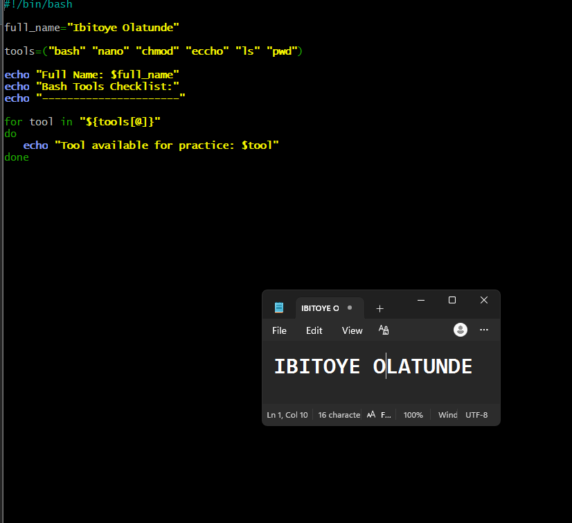

---

#### Screenshot 2 — Output of `./tools-checklist.sh`

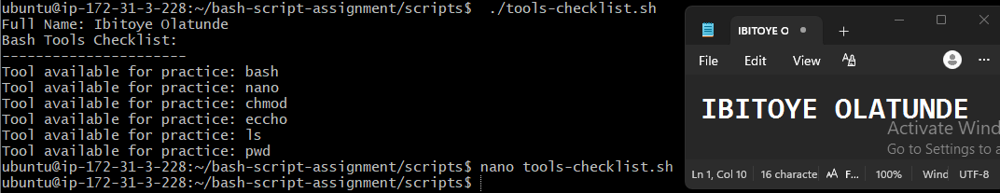

---

### Notes

Answer the following in your own words:

**1. What is an array in Bash?**

An array in Bash is used to store multiple values under a single variable name.

For example:

tools=("bash" "nano" "chmod" "echo" "ls" "pwd")

In this example, the tools array contains several Linux and Bash tools.

---

**2. Why are arrays useful in scripts?**

Arrays allow related values to be grouped together. Instead of creating a separate variable for each tool, all the tools can be stored in a single array.

This makes scripts shorter, easier to organize, and easier to update. Arrays can also be processed efficiently using loops.

---

**3. What does `"${tools[@]}"` mean?**

`"${tools[@]}"` represents all the individual values stored in the tools array.

It allows a loop to access each item in the array. The double quotes are important because they preserve each array element as a separate value, especially when an item contains spaces.

For example, if the array contains:

tools=("bash" "Linux and Bash")

using `"${tools[@]}"` keeps "Linux and Bash" as one complete array item.

---

**4. What is the purpose of the `for` loop in this script?**

The `for`  loop goes through each value in the tools array one at a time.

During each iteration, the current value is stored in the tool variable and can then be printed or processed.

For example:

First iteration: $tool contains bash
Second iteration: $tool contains nano
The loop continues until every item in the array has been processed.

This allows the script to perform the same operation on multiple values efficiently.

---

# Task 5 — Loops: Number Counter Script

## Goal

Use loops to repeat a task multiple times.

### Evidence

#### Screenshot 1 — Content of `counter.sh`

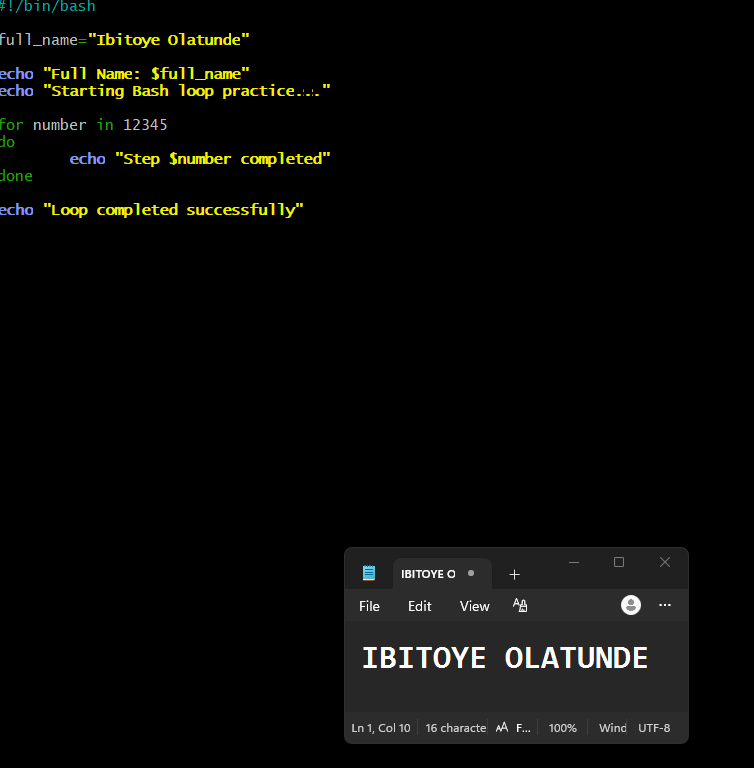

---

#### Screenshot 2 — Output of `./counter.sh`

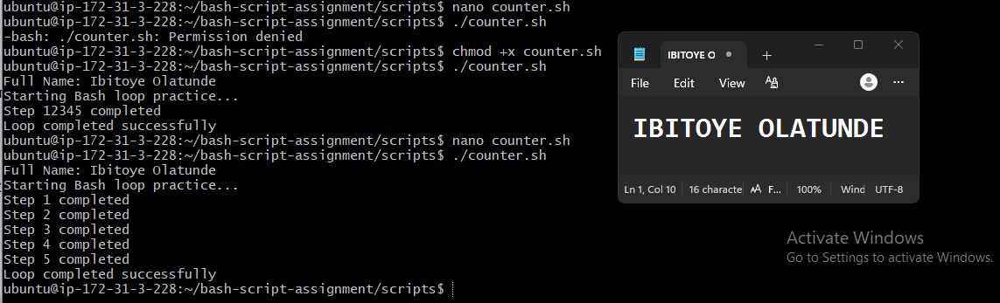

---

### Notes

Answer the following in your own words:

**1. What is a loop?**

A loop is a programming structure used to repeat a task multiple times.

Instead of writing the same command repeatedly, we can place the command inside a loop and allow Bash to execute it multiple times.

---

**2. Why do we use loops in Bash scripting?**

Loops are used to automate repetitive tasks. They make scripts shorter, more efficient, and easier to maintain because we do not need to write the same commands over and over again.

---

**3. How many times did the loop run in your script?**

The loop ran five times because it was given five values:

1 2 3 4 5

The loop executed once for each number.
---

**4. What would you change if you wanted the loop to run 10 times?**

I would add the numbers 6 through 10 to the list of values:

for number in 1 2 3 4 5 6 7 8 9 10
do
    echo "Step $number completed"
done

This would cause the loop to execute once for each number, resulting in a total of 10 iterations.

---

# Task 6 — Files & Conditionals: File Validation Script

## Goal

Use file checks and conditionals to verify whether files and directories exist.

### Evidence

#### Screenshot 1 — Output of `ls -lah ../test-folder`

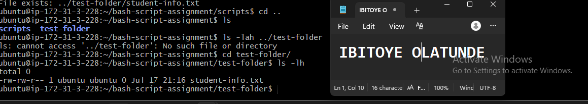

---

#### Screenshot 2 — Content of `file-check.sh`

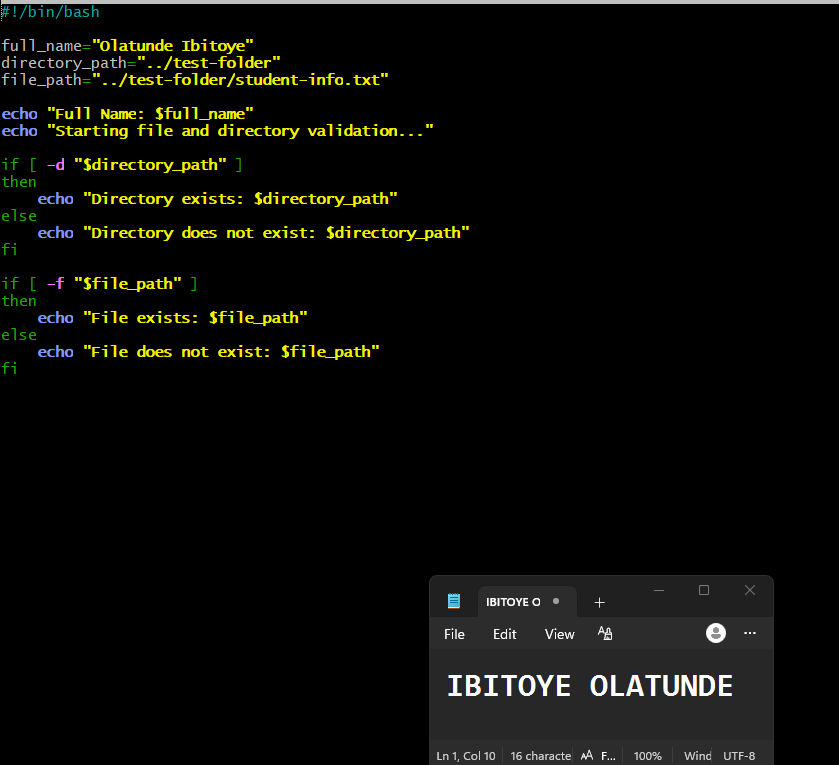

---

#### Screenshot 3 — Output of `./file-check.sh`

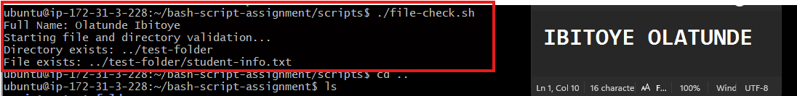

---

### Notes

Answer the following in your own words:

**1. What does `-d` check in Bash?**

The -d option checks whether a specified path exists and is a directory.

If the directory exists, the condition evaluates to true.

For example:

if [ -d "$folder" ]; then
    echo "Directory exists"
fi

---

**2. What does `-f` check in Bash?**

The -f option checks whether a specified path exists and is a regular file.

If the file exists and is a regular file, the condition evaluates to true.

---

**3. Why should file and directory paths be stored in variables?**

Storing file and directory paths in variables makes scripts easier to read, maintain, and update.

If a path changes, we only need to update the variable rather than manually changing the same path in multiple places throughout the script. This reduces repetition and the chance of errors.

---

**4. What happens if the file does not exist?**

If the file does not exist, the -f condition evaluates to false.

As a result, the commands inside the else block will run, and the script will display a message such as:

File does not exist: ../test-folder/student-info.txt

---

# Task 7 — Conditionals: Pass or Retry Script

## Goal

Use if-else conditionals to make decisions based on a variable value.

### Evidence

#### Screenshot 1 — Content of `score-check.sh` with `score=85`

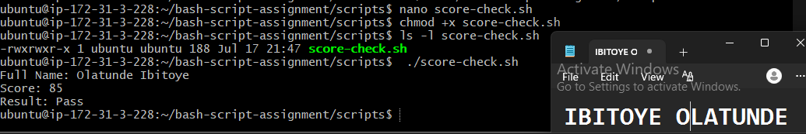

---

#### Screenshot 2 — Output showing `Result: Pass`

---

#### Screenshot 3 — Content of `score-check.sh` with `score=55`

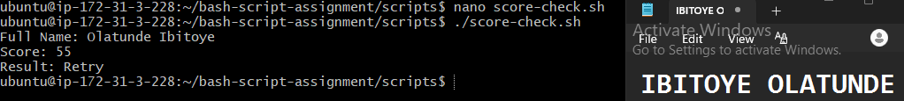

---

#### Screenshot 4 — Output showing `Result: Retry`

---

### Notes

Answer the following in your own words:

**1. What is the purpose of if-else in Bash?**

An if-else statement allows a Bash script to make decisions based on whether a condition is true or false.

If the condition is true, one set of commands is executed.
If the condition is false, another set of commands is executed.

This allows scripts to respond differently depending on the situation.

---

**2. What does `-ge` mean?**

-ge means greater than or equal to.

For example:

[ "$score" -ge 70 ]

This checks whether the value of score is greater than or equal to 70.

---

**3. Why should conditions be tested with different values?**

Conditions should be tested with different values to ensure that every possible result behaves correctly.

For example:

85 can test the passing condition.
55 can test the retry or failing condition.
70 should also be tested because it is the exact boundary value and should pass when using -ge 70.

Testing different values helps identify logic errors and confirms that the script handles different situations correctly.

---

**4. How can conditionals help in automation scripts?**

Conditionals allow automation scripts to make decisions based on the current state of a system.

For example, a script can check whether:

A service is running.
A file or directory exists.
Disk space is becoming low.
A command succeeded or failed.

Based on the result, the script can then take the appropriate action automatically. This makes automation scripts more intelligent and useful for system administration and DevOps tasks.

---

# Task 8 — Functions: Final Bash Automation Script

## Goal

Create a final Bash script using functions to organize reusable code.

### Evidence

#### Screenshot 1 — Content of `final-automation.sh`

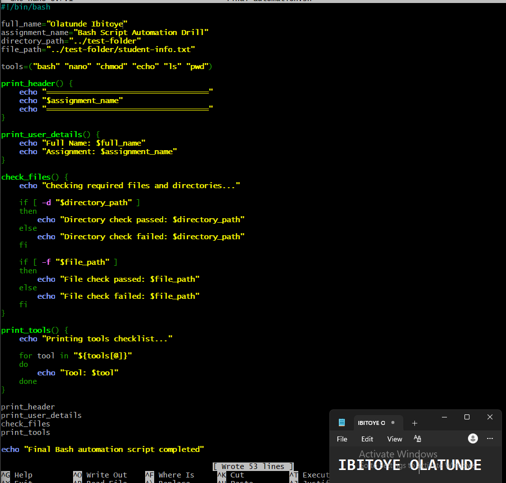

---

#### Screenshot 2 — Output of `./final-automation.sh`

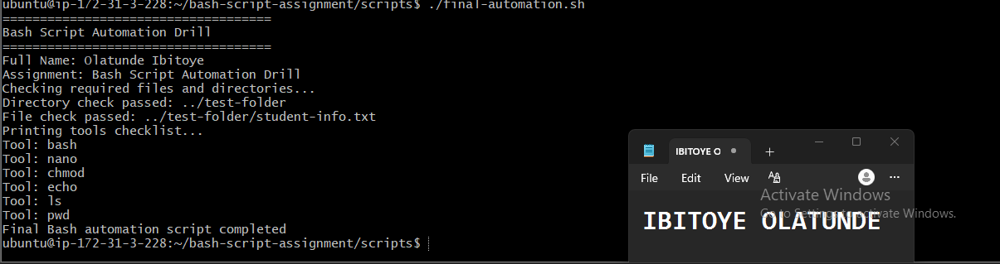

---

#### Screenshot 3 — Output of `ls -lah` showing all created scripts

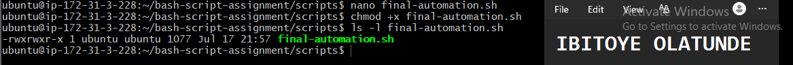

---

### Notes

Answer the following in your own words:

**1. What is a function in Bash?**

A function is a named block of commands created to perform a specific task.

Once a function has been defined, all the commands inside it can be executed by calling the function's name. This allows related commands to be grouped together and reused when needed.

---

**2. Why are functions useful in scripts?**

Functions help divide a large script into smaller, organized sections. This makes the script easier to read, manage, maintain, and troubleshoot.

Functions are also useful when the same task needs to be performed multiple times. Instead of rewriting the same commands, we can define them once inside a function and call that function whenever it is needed.

---

**3. Which functions did you create in this script?**

I created four functions:

print_header — Prints the assignment header.
print_user_details — Prints my full name and the assignment name.
check_files — Checks whether the required directory and file exist.
print_tools — Uses a loop to print each tool stored in the array.

---

**4. How does this final script combine variables, arrays, loops, conditionals, files, and functions?**

The script uses variables to store information such as my name, the assignment name, and the required file and directory paths.

It uses an array to store the names of different tools, while a loop processes and prints each tool one at a time.

The script also uses if-else conditionals together with the -d and -f tests to check whether the required directory and file exist.

Finally, the related commands are organized into functions. These functions are then called in the correct order to execute the complete automation script.

Together, these Bash features make the script more organized, reusable, readable, and easier to maintain.

---

# LinkedIn Post (Required)

## Evidence

#### LinkedIn Post URL

Paste your LinkedIn post URL here:

`https://www.linkedin.com/posts/olatunde-ibitoye_devops-linux-bash-activity-7484007577291464705-kcmV?utm_source=share&utm_medium=member_desktop&rcm=ACoAAB_xj1QBIy4RnDuKMoQp8yo4i8QCKxf266A`

---

#### Screenshot — Published LinkedIn post

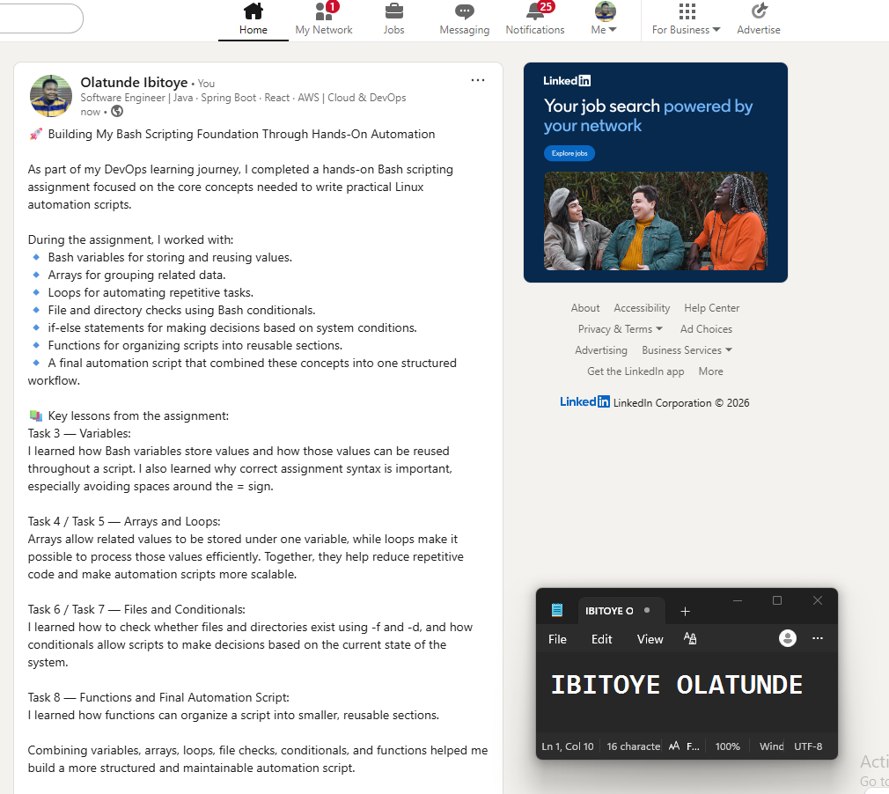

---

# Submission Instructions

- Add all required screenshots in your submission
- Full name must be visible in required screenshots
- All script files must be created and run successfully
- Required notes must be answered clearly for every task
- Do not expose sensitive information (keys, passwords, credentials)

---

# Completion Checklist

- [ ] Task 1: Environment setup verified, workspace created (Screenshots 1–2, Notes answered)
- [ ] Task 2: First script created, executed, permissions verified (Screenshots 1–3, Notes answered)
- [ ] Task 3: Variables script created and run (Screenshots 1–2, Notes answered)
- [ ] Task 4: Arrays and loops script created and run (Screenshots 1–2, Notes answered)
- [ ] Task 5: Counter loop script created and run (Screenshots 1–2, Notes answered)
- [ ] Task 6: File validation script created and run (Screenshots 1–3, Notes answered)
- [ ] Task 7: Pass/Retry conditional script tested with both values (Screenshots 1–4, Notes answered)
- [ ] Task 8: Final automation script created and run (Screenshots 1–3, Notes answered)
- [ ] All scripts run without errors
- [ ] Full Name visible in all required screenshots
- [ ] LinkedIn post published and URL submitted
- [ ] No sensitive data exposed

---

## 📌 About DMI & CloudAdvisory

DevOps Micro Internship (DMI) is a project-based DevOps program run by Pravin Mishra (The CloudAdvisory) focused on real-world execution, systems thinking, and career readiness.

It helps learners build strong DevOps foundations with hands-on experience.

---

## 📌 Resources

- 🌐 DMI Official Website: https://pravinmishra.com/dmi  
- 🎓 DevOps for Beginners (Udemy): https://www.udemy.com/course/devops-for-beginners-docker-k8s-cloud-cicd-4-projects/  
- 🎓 Agentic AI DevOps with Claude Code: https://www.udemy.com/course/ultimate-agentic-ai-devops-with-claude-code/  
- 🎓 DevOps with Claude Code: Terraform, EKS, ArgoCD & Helm: https://www.udemy.com/course/devops-with-claude-code-terraform-eks-argocd-helm/  
- ▶️ YouTube Playlist: https://www.youtube.com/playlist?list=PLFeSNDtI4Cho  
- 🔗 Pravin Mishra (LinkedIn): https://www.linkedin.com/in/pravin-mishra-aws-trainer/  
- 🏢 CloudAdvisory (LinkedIn): https://www.linkedin.com/company/thecloudadvisory/

---

*This submission is part of DevOps Micro Internship (DMI) Cohort 3 — Agentic AI Track.*