# Assignment 6 — Build an AI-Assisted Linux Health Check (AI-Assisted Linux Incident Triage)

Part of the DevOps Micro Internship (DMI) Cohort 3 with Agentic AI

---

## Purpose

In this assignment, you will build a read-only Bash triage script that checks the health of your Ubuntu server and Nginx application, connect it to Claude Code as a reusable `/linux-triage` skill, simulate a controlled Nginx incident, use the skill to gather and analyze evidence, recover the service manually, and verify recovery. The workflow follows the Agentic Loop: Gather → Analyze → Human Act → Verify.

---

# Task 1 — Confirm the Healthy Baseline and Create the Workspace

## Goal

Confirm that Nginx and the React application are healthy before building the automation.

### Evidence

#### Screenshot 1 — Output of `systemctl is-active nginx`, `ss -ltn | grep ':80'`, and `curl -I http://localhost`

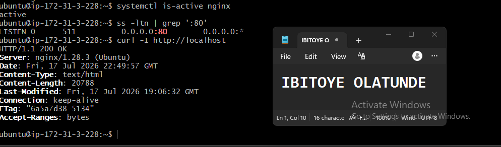

---

#### Screenshot 2 — Output of `pwd` and `find . -maxdepth 4 -type d | sort` showing the workspace folder structure

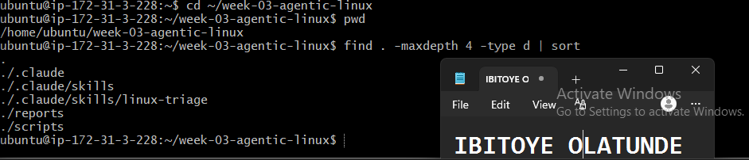

---

### Notes

Answer the following in your own words:

**1. What proves that Nginx is running?**

Running:

systemctl is-active nginx

and receiving the output:

active

confirms that the Nginx service is currently running.

---

**2. What proves that the server is listening for HTTP traffic?**

Running:

ss -ltn | grep ':80'

and seeing port 80 in the listening state confirms that the server is ready to receive HTTP requests.

Port 80 is the standard port used for HTTP traffic, so this verifies that a service is listening for incoming HTTP connections.

---

**3. Why must you capture a healthy baseline before simulating an incident?**

A healthy baseline provides a reference point for comparison.

First, I need to confirm and record the normal working state of the system. After simulating the incident, I can compare the failed state with the original healthy state to understand exactly what changed.

Once the issue has been fixed, I can perform the same checks again to confirm that the system has returned to its normal operating condition.

This makes the incident simulation easier to analyze and provides evidence that the recovery was successful.

---

# Task 2 — Create Project Context and Safety Rules in CLAUDE.md

## Goal

Tell Claude exactly what this project does and what it is not allowed to do.

### Evidence

#### Screenshot 3 — CLAUDE.md open in VS Code showing all four sections (Project Overview, Incident Workflow, Safety Rules, Output Rules)

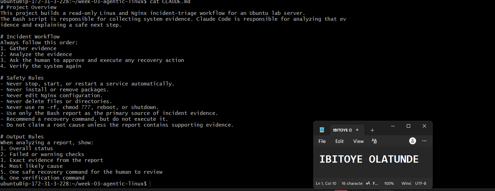

---

### Notes

Answer the following in your own words:

**1. Why should Claude receive project-specific operational rules?**

Claude should receive project-specific operational rules so it understands the purpose of the project, the required workflow, and the actions it is allowed or not allowed to take.

These rules help Claude provide responses that are relevant to the specific incident workflow and prevent it from making unnecessary or potentially unsafe changes to the server.

---

**2. Why is the human required to execute the recovery command?**

The human is required to execute the recovery command because a person must review the available evidence and decide whether the recommended action is safe and appropriate.

Claude can analyze the incident report and recommend a recovery command, but it should not independently make changes to the production server. This human approval step provides an important safety control and helps prevent incorrect or destructive actions.

---

**3. Which rule prevents Claude from making an unsupported diagnosis?**

The rule “Do not claim a root cause unless the report contains supporting evidence” prevents Claude from making an unsupported diagnosis.

This ensures that Claude only identifies a root cause when the available evidence actually supports that conclusion. If the evidence is insufficient, Claude should clearly state what is known, what is unknown, and what additional information may be needed.

---

# Task 3 — Use Agentic AI to Plan Before Writing the Script

## Goal

Use Claude Code to inspect the environment and produce a read-only plan before creating any Bash code.

### Evidence

#### Screenshot 4 — Claude Code showing the five-check plan and read-only inspection results

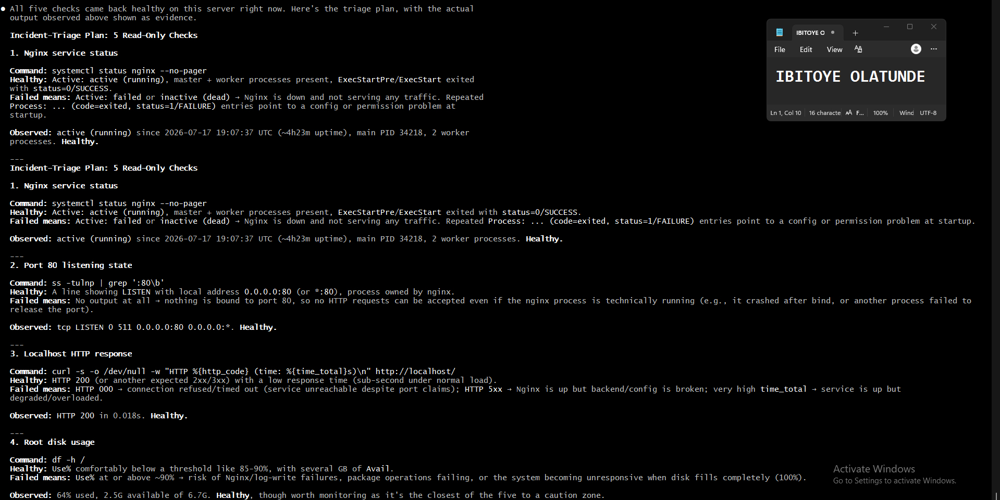

---

### Notes

Answer the following in your own words:

**1. Which part of this task represents the Gather phase?**

The read-only inspection of the Ubuntu server represents the Gather phase.

During this phase, Claude collects information about the current state of the system, including:

The Nginx service status.
Whether port 80 is listening for HTTP traffic.
The HTTP response from the application.
Disk usage.
Available memory.

This information provides the evidence needed to understand the current health of the server before taking any action.

---

**2. Did Claude follow the instruction not to create files? How did you verify this?**

Yes. Claude followed the instruction and only performed read-only checks.

I verified this by listing the files in the workspace and checking that no new Bash script or other unexpected file had been created. This confirmed that Claude gathered information without modifying the workspace.

---

**3. Why is planning before coding useful in DevOps automation?**

Planning before coding helps define what the automation script should check and what each possible result means.

It also helps identify missing steps, unclear logic, and potentially unsafe actions before writing the code. This makes the final script more reliable, easier to understand, and less likely to require major changes after it has already been created.

---

# Task 4 — Build the Linux Triage Bash Script

## Goal

Create one Bash script that gathers consistent Linux and Nginx health evidence.

### Evidence

#### Screenshot 5 — Top section of `linux-triage.sh` showing variables, thresholds, and the checks array

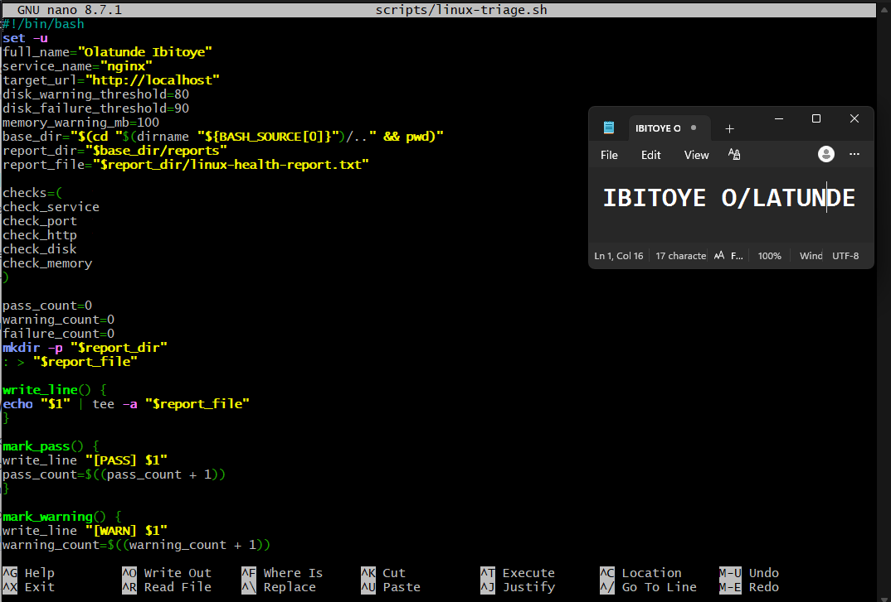

---

#### Screenshot 6 — Middle section showing check functions and conditionals

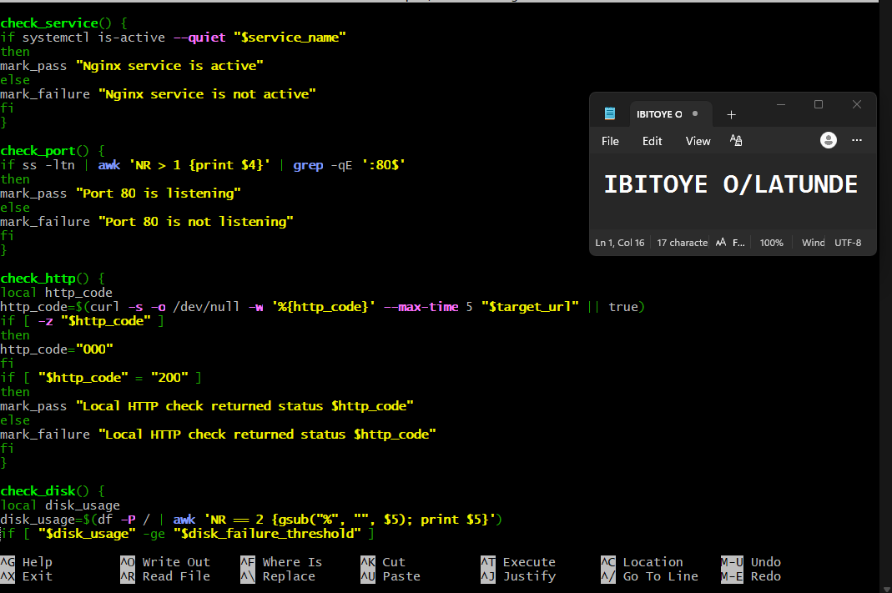

---

#### Screenshot 7 — Bottom section showing the loop, summary function, and exit behavior

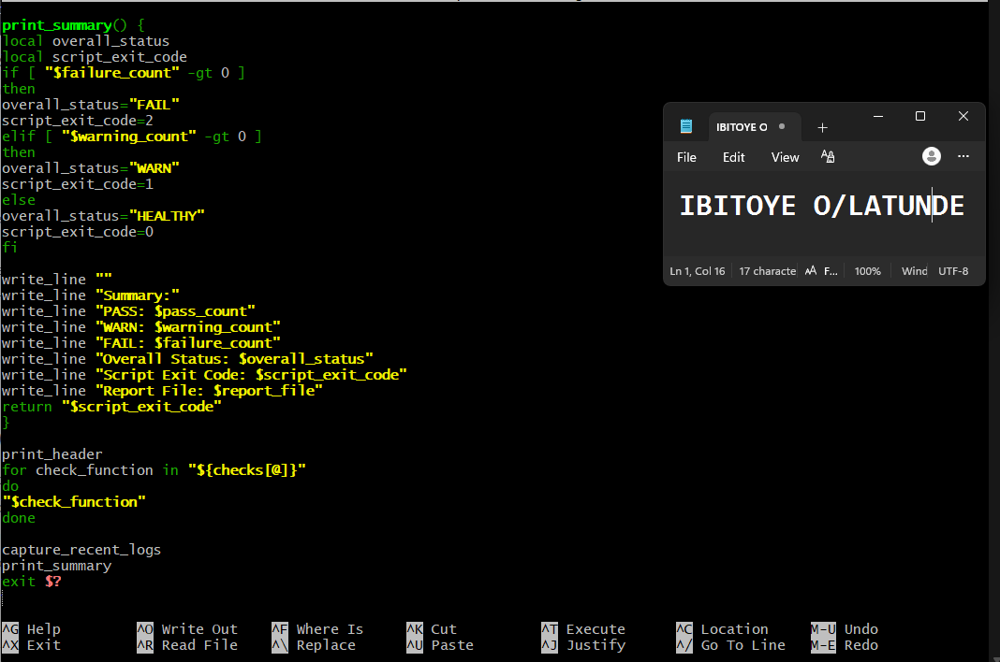

---

#### Screenshot 8 — Output of `bash -n scripts/linux-triage.sh` (no syntax errors) and `ls -l scripts/linux-triage.sh` showing executable permission

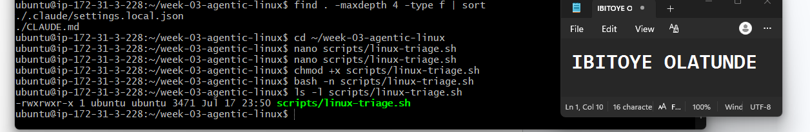

---

### Notes

Answer the following in your own words:

**1. What is stored in the checks array?**

The checks array stores the names of the five functions used to check the health of the Ubuntu server.

These functions check:

The Nginx service.
Port 80 availability.
The HTTP response.
Disk usage.
Available memory.

---

**2. How does the `for` loop use that array?**

The `for` loop goes through each function name stored in the checks array and executes the functions one at a time.

This allows the script to perform all five health checks in a defined order without having to manually call each function separately.

---

**3. Why are the health checks separated into functions?**

Each function is responsible for one specific health check.

This makes the script easier to read, test, update, and troubleshoot. If one check needs to be changed, it can usually be updated without affecting the other checks.

Separating the checks also makes the script more organized and reusable.

---

**4. What is the purpose of `$(...)` in this script?**

`$(...)` is called command substitution. It runs a command and captures its output so that the result can be stored in a variable or used elsewhere in the script.

For example, the script can use command substitution to collect:

The current timestamp.
The hostname.
The HTTP status code.
Disk usage information.
Available memory.
Recent Nginx log entries.

This allows the script to gather live system information and use it in the health-check report.

---

**5. Why does the script use different exit codes for HEALTHY, WARN, and FAIL?**

Different exit codes communicate the final health status of the server to the user or to another automation tool.

The script uses:

0 — All health checks passed; the system is healthy.
1 — A warning was detected, but the system may still be operating normally.
2 — At least one critical check failed.

This allows the result to be understood quickly without needing to read the entire report. Automation tools and monitoring systems can also use these exit codes to decide what action should be taken next.

---

# Task 5 — Run and Understand the Healthy-State Report

## Goal

Run the Bash script against the healthy server and verify that it creates a report.

### Evidence

#### Screenshot 9 — Output of `./scripts/linux-triage.sh` showing your Full Name and all five check results

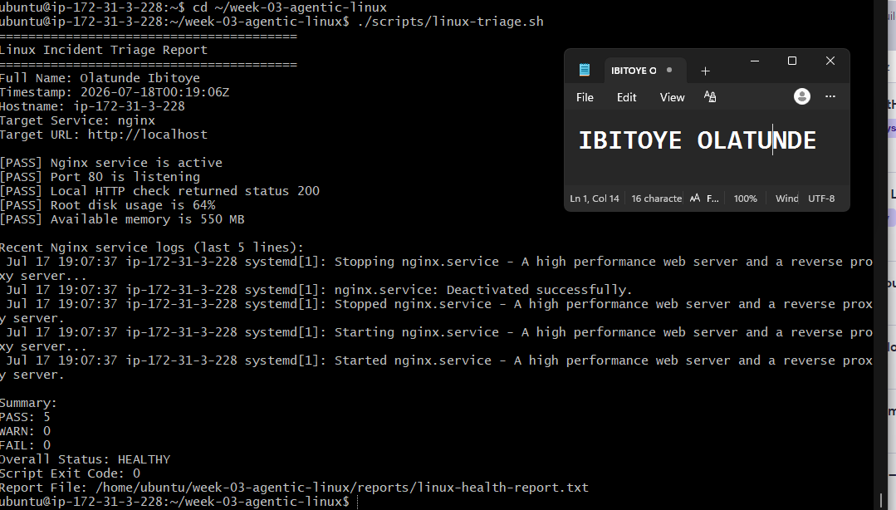

---

#### Screenshot 10 — Output showing the captured exit code and final summary

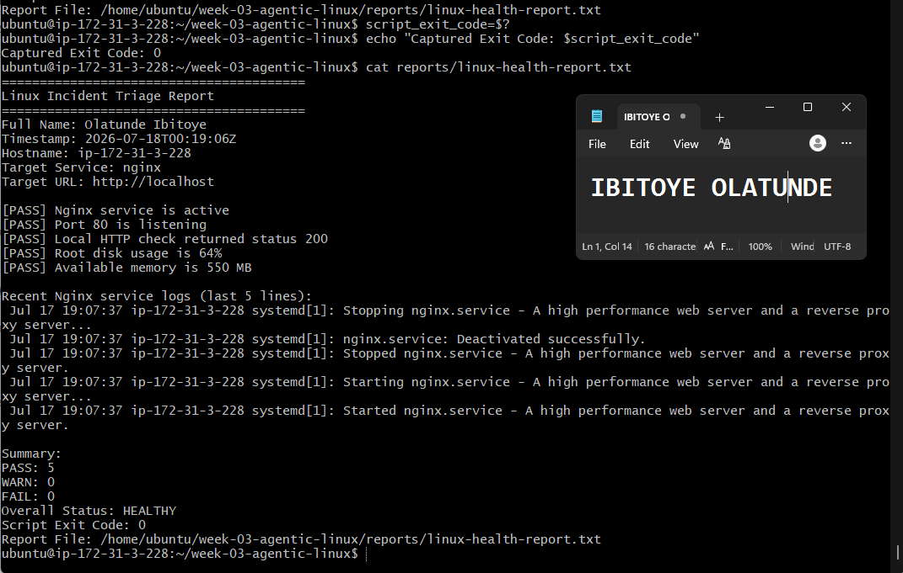

---

### Notes

Answer the following in your own words:

**1. What is the overall status of your healthy baseline?**

The overall status of my healthy baseline is HEALTHY.

The report did not contain any failed checks, which confirms that the Nginx service, HTTP traffic, application response, disk usage, and memory availability were all within the expected healthy conditions. I can therefore proceed to the incident simulation.

---

**2. Which exact Linux evidence proves the application is serving traffic?**

The report provides two important pieces of evidence:

[PASS] Port 80 is listening
[PASS] Local HTTP check returned status 200

The Port 80 is listening result confirms that the server is ready to receive HTTP traffic.

The HTTP status 200 confirms that the application successfully responded to an HTTP request through Nginx.

Together, these results provide evidence that the web server is listening and that the application is successfully serving traffic.

---

**3. Did your script return exit code 0 or 1? Explain why.**

My script returned exit code 0 because all five health checks passed.

Nginx was active, port 80 was listening, the application returned HTTP status 200, and disk usage and available memory were within the defined healthy limits.

---

**4. What is the difference between a warning and a failure in this script?**

A warning means the server and application are still functioning, but a resource condition requires attention.

In this script, a warning occurs when:

Root disk usage is between 80% and 89%.
Available memory is below 100 MB.

A failure means that a critical health check did not pass. This occurs when:

Nginx is inactive.
Port 80 is not listening.
The application does not return HTTP status 200.
Root disk usage reaches 90% or higher.

The distinction allows the script to separate conditions that require monitoring from problems that require immediate investigation and recovery.

---

# Task 6 — Create and Run the /linux-triage Skill

## Goal

Turn the Bash script into a reusable, manually invoked Agentic AI workflow.

### Evidence

#### Screenshot 11 — `SKILL.md` showing the frontmatter, allowed tool restrictions, and safety rules

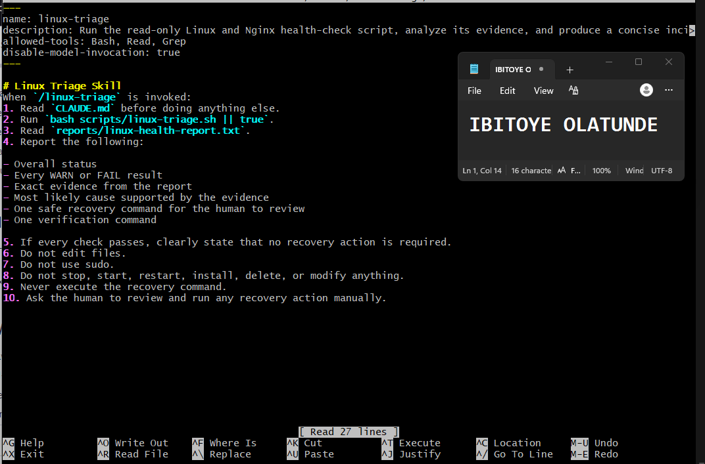

---

#### Screenshot 12 — `/linux-triage` output for the healthy server

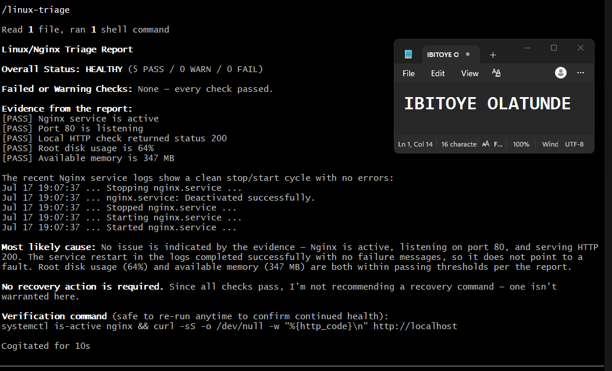

---

### Notes

Answer the following in your own words:

**1. Why does this skill have Bash, Read, and Grep, but not Write?**

The skill needs Bash to execute the Linux triage script, Read to open the generated health report, and Grep to search the report for specific results such as PASS, WARN, or FAIL.

It does not need the Write tool because Claude should not create or modify project files during the triage process. The purpose of the skill is to inspect the system and analyze evidence, not to change the server or workspace.

---

**2. Why is `disable-model-invocation: true` useful for this skill?**

The setting disable-model-invocation: true prevents Claude from automatically deciding to run the skill on its own.

Instead, I must manually invoke /linux-triage. This keeps the server inspection under my control and ensures that the triage process only runs when I explicitly request it.

---

**3. What part is performed by Bash, and what part is performed by Claude?**

The Bash script performs the actual system checks. It checks:

Whether Nginx is running.
Whether port 80 is listening.
The HTTP response from the application.
Disk usage.
Available memory.
Recent Nginx logs.

The script then records the results in linux-health-report.txt.

Claude reads and analyzes that report. It explains the results, identifies warnings or failures, and recommends a safe next step based on the available evidence.

Claude does not independently perform the recovery action.

---

**4. Why is this better than asking Claude "Is my server healthy?" without giving it evidence?**

Simply asking Claude whether a server is healthy does not provide enough information about the actual current state of that server. Without evidence, Claude would have to make assumptions or provide a general answer.

The /linux-triage skill first collects current evidence using the Bash script. Claude can then base its analysis on real information, including the Nginx status, listening ports, HTTP response, disk usage, memory availability, and recent logs.

This makes the diagnosis more reliable, evidence-based, and less likely to be based on guesswork.

---

# Task 7 — Simulate an Nginx Incident and Let the Skill Diagnose It

## Goal

Create a controlled service failure, gather evidence through Bash, and let Claude analyze the evidence without taking recovery action.

### Evidence

#### Screenshot 13 — Output showing Nginx is inactive and the HTTP request fails

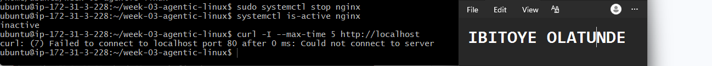

---

#### Screenshot 14 — `/linux-triage` output showing failed evidence, most likely cause, and a suggested recovery command

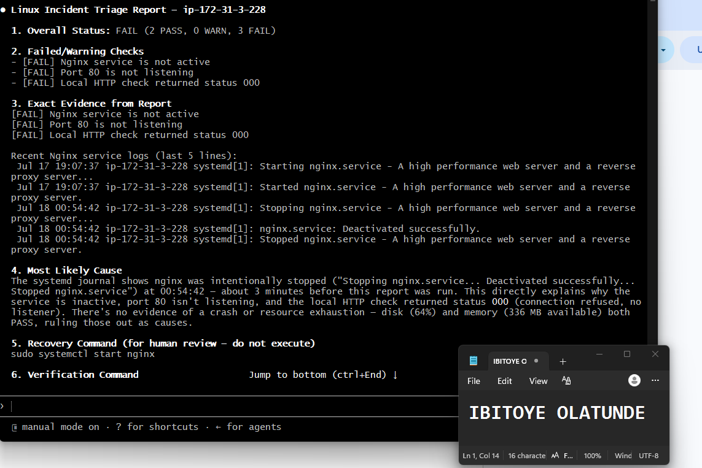

---

#### Screenshot 15 — `incident-failure-report.txt` showing the failed checks and your Full Name

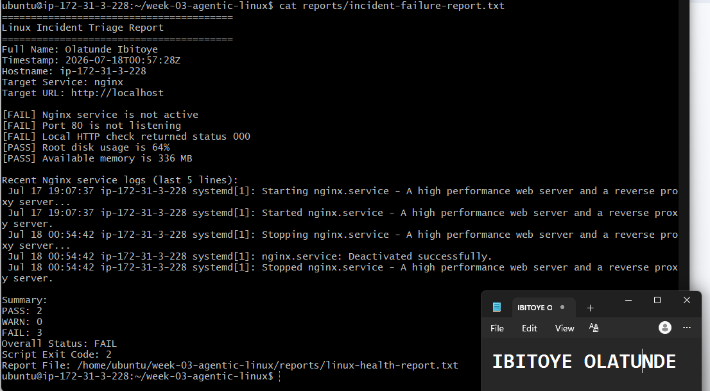

---

### Notes

Answer the following in your own words:

**1. Which three checks failed?**

The following three checks failed:

Nginx service check — Nginx was no longer active.
Port 80 check — Port 80 was no longer listening for HTTP traffic.
Local HTTP check — The local HTTP request returned status 000.

The disk and memory checks were not affected by stopping Nginx and continued to operate normally.

---

**2. What evidence supports the conclusion that Nginx is unavailable?**

The report provides three related pieces of evidence:

Nginx is not active.
Port 80 is not listening.
The local HTTP request returned status 000.

Together, these results strongly support the conclusion that Nginx is unavailable and that the application cannot currently receive or serve HTTP traffic.

---

**3. Did Claude execute the recovery command? Why is that important?**

No. Claude only recommended the recovery command.

This is important because I must review the evidence and approve the proposed action before making a change to the server. This human approval step prevents an AI tool from automatically changing a service during an incident based on an incorrect or unsupported diagnosis.

---

**4. Which phase of the Agentic Loop is represented by the Bash report?**

The Bash report represents the Gather phase of the Agentic Loop.

The script collects current evidence about the system, including:

Nginx status.
Port 80 availability.
HTTP response status.
Disk usage.
Available memory.
Recent logs.

---

**5. Which phase is represented by Claude's explanation?**

Claude's explanation represents the Analyze phase.

Claude reviews the evidence collected by the Bash script, identifies the failed checks, explains the likely problem based on the available evidence, and recommends a recovery command for human review.

The human then remains responsible for deciding whether the recommended recovery action should actually be executed.

---

# Task 8 — Recover Manually, Verify Again, and Write the Incident Summary

## Goal

Recover the service as the human operator and prove that the system is healthy again.

### Evidence

#### Screenshot 16 — Output showing Nginx is active and `curl -I http://localhost` returns 200 OK

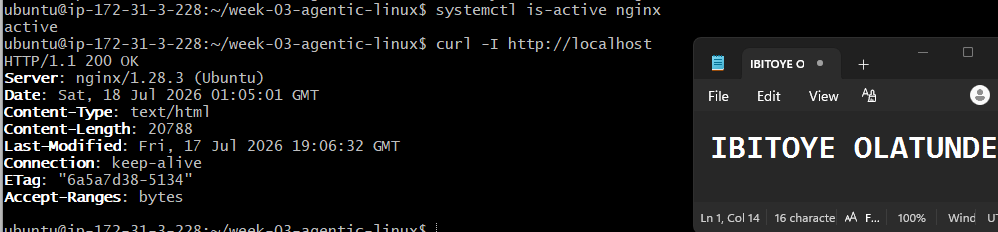

---

#### Screenshot 17 — Second `/linux-triage` output showing successful recovery with no FAIL results

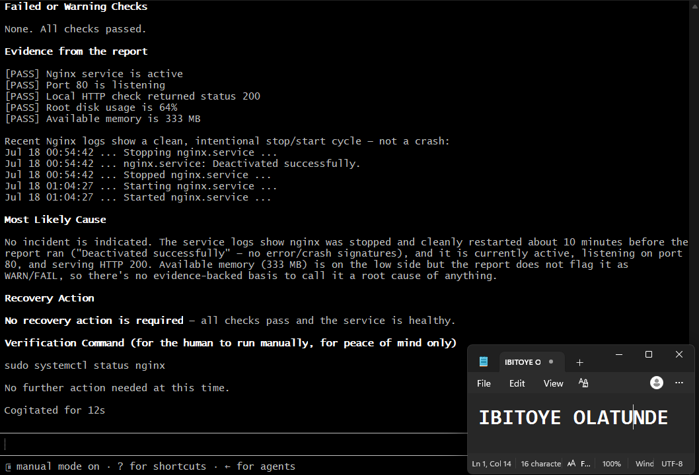

---

#### Screenshot 18 — Output of `ls -lah reports` showing both `incident-failure-report.txt` and `recovery-report.txt`

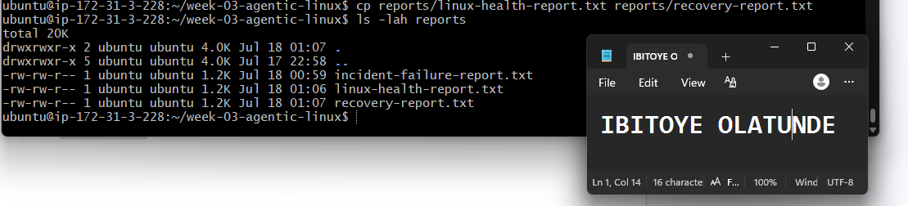

---

#### Screenshot 19 — `incident-summary.md` showing all required sections and your Full Name

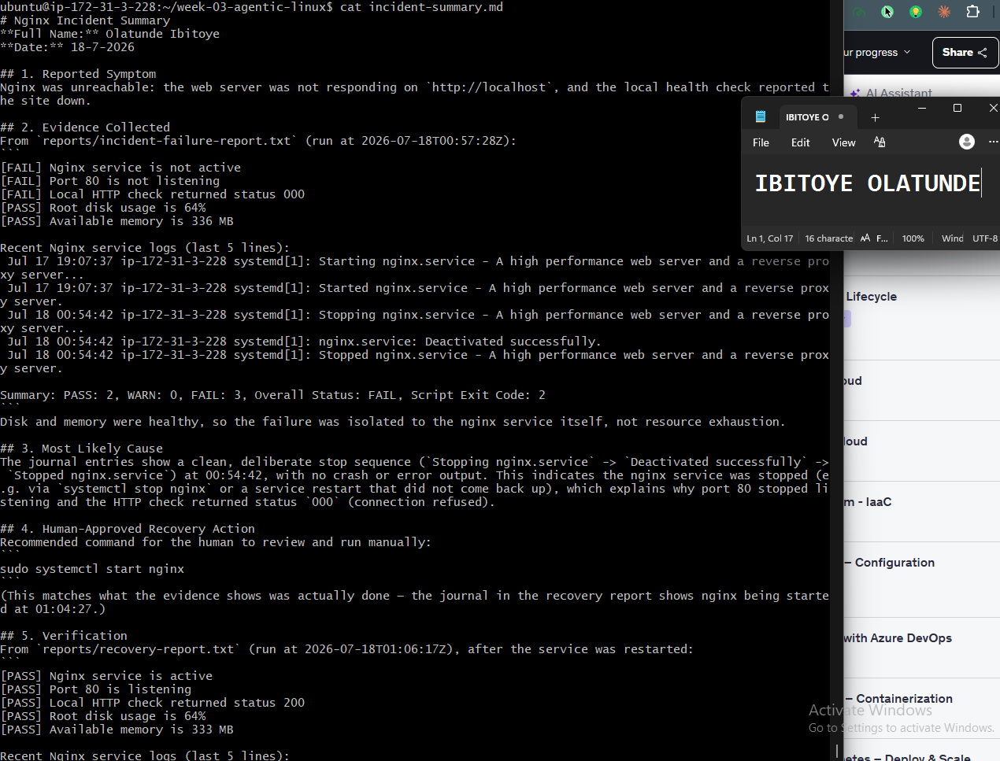

---

### Notes

Answer the following in your own words:

**1. What action did you execute manually?**

After reviewing the evidence and Claude's recommendation, I manually executed:

sudo systemctl start nginx

This started the Nginx service again.

---

**2. What evidence proves that the service recovered?**

Several pieces of evidence confirmed that the service recovered successfully:

systemctl is-active nginx returned active.
The local HTTP request returned HTTP/1.1 200 OK.
The second /linux-triage run showed that the Nginx service, port 80, and HTTP checks had all passed.

Together, these results confirmed that Nginx was running again and the application was successfully serving HTTP traffic.

---

**3. Why is the second triage run necessary?**

Starting Nginx does not automatically prove that the entire application and server are healthy.

The second triage run checks the Nginx service, port 80, HTTP response, disk usage, memory, and recent logs again. This provides evidence that the system has returned to a healthy state and that no additional problems remain after the recovery action.

---

**4. What could go wrong if an AI agent automatically restarted every failed service?**

A failed service may have a configuration problem, resource issue, dependency failure, or another serious underlying cause.

Automatically restarting every failed service could hide the real problem, create a restart loop, cause additional failures, or make the incident worse. The available evidence should therefore be reviewed before taking recovery action.

---

**5. In one sentence, explain the difference between using AI as a chatbot and using AI in this agentic workflow.**

A chatbot simply answers a question, while in this agentic workflow, Claude uses tools to gather and analyze real server evidence, recommends a safe next step, and the human remains responsible for approving and performing the recovery action.

---

# Incident Summary

Fill in all seven sections below in your own words.

**Full Name:** Olatunde Ibitoye
**Date:** 18-7-2026

---

## 1. Reported Symptom
Nginx was unreachable: the web server was not responding on `http://localhost`, and the local health check reported the site down.

---

## 2. Evidence Collected
From `reports/incident-failure-report.txt` (run at 2026-07-18T00:57:28Z):
```
[FAIL] Nginx service is not active
[FAIL] Port 80 is not listening
[FAIL] Local HTTP check returned status 000
[PASS] Root disk usage is 64%
[PASS] Available memory is 336 MB

Recent Nginx service logs (last 5 lines):
 Jul 17 19:07:37 ip-172-31-3-228 systemd[1]: Starting nginx.service - A high performance web server and a reverse proxy server...
 Jul 17 19:07:37 ip-172-31-3-228 systemd[1]: Started nginx.service - A high performance web server and a reverse proxy server.
 Jul 18 00:54:42 ip-172-31-3-228 systemd[1]: Stopping nginx.service - A high performance web server and a reverse proxy server...
 Jul 18 00:54:42 ip-172-31-3-228 systemd[1]: nginx.service: Deactivated successfully.
 Jul 18 00:54:42 ip-172-31-3-228 systemd[1]: Stopped nginx.service - A high performance web server and a reverse proxy server.

Summary: PASS: 2, WARN: 0, FAIL: 3, Overall Status: FAIL, Script Exit Code: 2
```
Disk and memory were healthy, so the failure was isolated to the nginx service itself, not resource exhaustion.

---
## 3. Most Likely Cause
The journal entries show a clean, deliberate stop sequence (`Stopping nginx.service` -> `Deactivated successfully` -> `Stopped nginx.service`) at 00:54:42, with no crash or error output. This indicates the nginx service was stopped (e.g. via `systemctl stop nginx` or a service restart that did not come back up), which explains why port 80 stopped listening and the HTTP check returned status `000` (connection refused).

---
## 4. Human-Approved Recovery Action
Recommended command for the human to review and run manually:
```
sudo systemctl start nginx
```
(This matches what the evidence shows was actually done — the journal in the recovery report shows nginx being started at 01:04:27.)

---
## 5. Verification
From `reports/recovery-report.txt` (run at 2026-07-18T01:06:17Z), after the service was restarted:
```
[PASS] Nginx service is active
[PASS] Port 80 is listening
[PASS] Local HTTP check returned status 200
[PASS] Root disk usage is 64%
[PASS] Available memory is 333 MB

Recent Nginx service logs (last 5 lines):
 ...
 Jul 18 01:04:27 ip-172-31-3-228 systemd[1]: Starting nginx.service - A high performance web server and a reverse proxy server...
 Jul 18 01:04:27 ip-172-31-3-228 systemd[1]: Started nginx.service - A high performance web server and a reverse proxy server.

Summary: PASS: 5, WARN: 0, FAIL: 0, Overall Status: HEALTHY, Script Exit Code: 0
```
Port 80 listening again and the HTTP check returning 200 confirm nginx and the application recovered.

---
## 6. Safety Decision
The AI skill was restricted to read-only evidence gathering and analysis because restarting a production-facing service is a state-changing action with real consequences (dropped connections, masking a deeper root cause, or restarting a service that is failing for a reason the evidence doesn't yet explain). Per the project's safety rules, only a human can approve and execute recovery actions — the AI's role is limited to surfacing evidence and recommending, never executing, the fix.

---
## 7. Agentic Loop Mapping
- **Gather** — `scripts/linux-triage.sh` collected evidence into `reports/incident-failure-report.txt` (service, port, HTTP, disk, memory checks, plus recent journal logs).
- **Analyze** — Claude Code reviewed the FAIL report and identified the stopped nginx service as the cause, using only the evidence present in the report.
- **Human Act** — The human reviewed the recommended `sudo systemctl start nginx` command and executed it manually (per the journal timestamp 01:04:27).
- **Verify** — `scripts/linux-triage.sh` was run again, producing `reports/recovery-report.txt`, confirming Overall Status: HEALTHY.

---

# LinkedIn Post (Required)

## Evidence

#### LinkedIn Post URL

Paste your LinkedIn post URL here:

`https://www.linkedin.com/posts/olatunde-ibitoye_devops-linux-bash-ugcPost-7484058221586939904-1vUl/?utm_source=share&utm_medium=member_desktop&rcm=ACoAAB_xj1QBIy4RnDuKMoQp8yo4i8QCKxf266A`

---

#### Screenshot — Published LinkedIn post

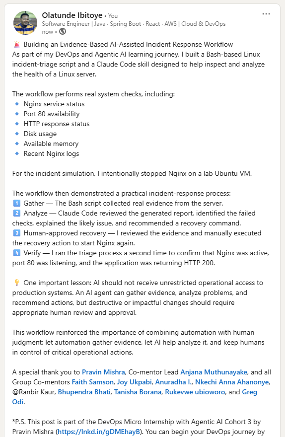

---

# GitHub Repository URL

Paste the URL of your GitHub folder or repository containing the assignment files here:

`https://github.com/horlartundhey/devops-micro-internship-pravinmishra/tree/main`

---

# Submission Instructions

- Add all required screenshots in your submission
- Full Name must be visible in required screenshots and the Bash report
- All written answers must be in your own words
- Do not expose sensitive information (keys, passwords, AWS account IDs, tokens)
- GitHub URL must be included in this document

---

# Completion Checklist

- [ ] Task 1: Healthy baseline confirmed, workspace created (Screenshots 1–2, Notes answered)
- [ ] Task 2: CLAUDE.md created with all four sections (Screenshot 3, Notes answered)
- [ ] Task 3: Five-check plan produced by Claude using read-only tools (Screenshot 4, Notes answered)
- [ ] Task 4: `linux-triage.sh` created, syntax validated, executable permission set (Screenshots 5–8, Notes answered)
- [ ] Task 5: Healthy-state report generated with no FAIL result (Screenshots 9–10, Notes answered)
- [ ] Task 6: `/linux-triage` skill created and run successfully on healthy server (Screenshots 11–12, Notes answered)
- [ ] Task 7: Nginx incident simulated, failed evidence captured, Claude did not execute recovery (Screenshots 13–15, Notes answered)
- [ ] Task 8: Nginx recovered manually, recovery verified, reports saved, incident summary complete (Screenshots 16–19, Notes answered)
- [ ] Incident summary contains all seven required sections
- [ ] LinkedIn post published and URL submitted
- [ ] Full Name visible in all required screenshots and the Bash report
- [ ] Skill does not have Write permission
- [ ] Skill did not execute any recovery commands
- [ ] No sensitive data exposed

---

## 📌 About DMI & CloudAdvisory

DevOps Micro Internship (DMI) is a project-based DevOps program run by Pravin Mishra (The CloudAdvisory) focused on real-world execution, systems thinking, and career readiness.

It helps learners build strong DevOps foundations with hands-on experience.

---

## 📌 Resources

- 🌐 DMI Official Website: https://pravinmishra.com/dmi  
- 🎓 DevOps for Beginners (Udemy): https://www.udemy.com/course/devops-for-beginners-docker-k8s-cloud-cicd-4-projects/  
- 🎓 Agentic AI DevOps with Claude Code: https://www.udemy.com/course/ultimate-agentic-ai-devops-with-claude-code/  
- 🎓 DevOps with Claude Code: Terraform, EKS, ArgoCD & Helm: https://www.udemy.com/course/devops-with-claude-code-terraform-eks-argocd-helm/  
- ▶️ YouTube Playlist: https://www.youtube.com/playlist?list=PLFeSNDtI4Cho  
- 🔗 Pravin Mishra (LinkedIn): https://www.linkedin.com/in/pravin-mishra-aws-trainer/  
- 🏢 CloudAdvisory (LinkedIn): https://www.linkedin.com/company/thecloudadvisory/

---

*This submission is part of DevOps Micro Internship (DMI) Cohort 3 — Agentic AI Track.*