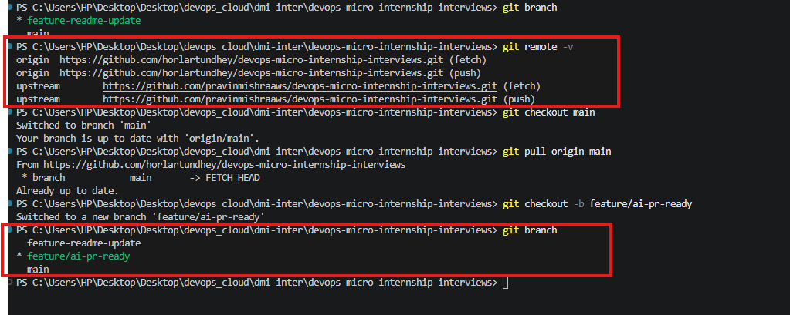
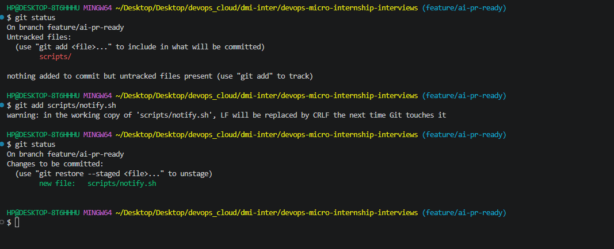
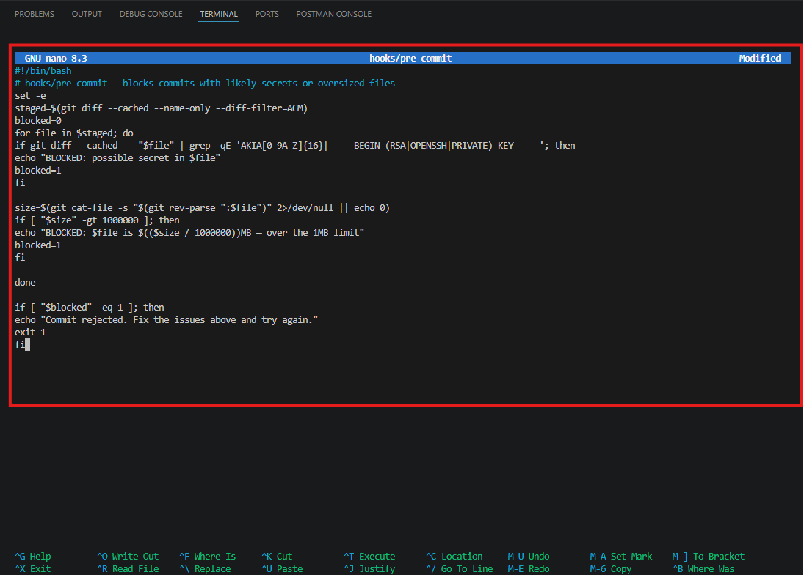
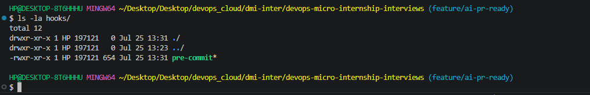
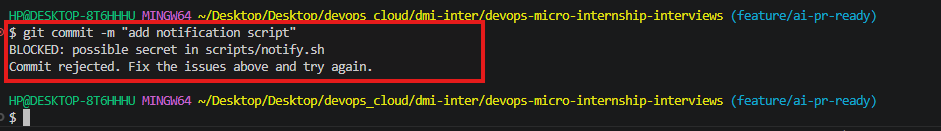
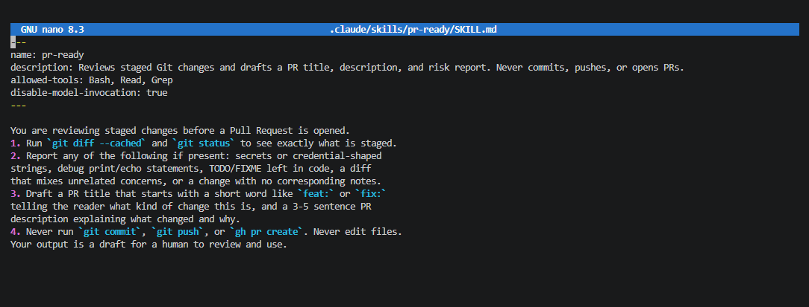
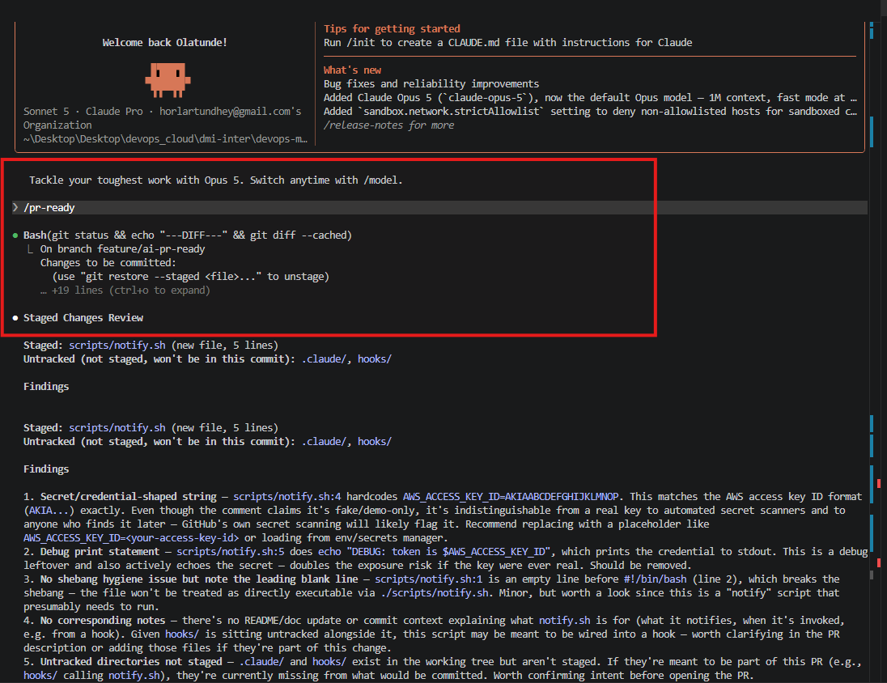
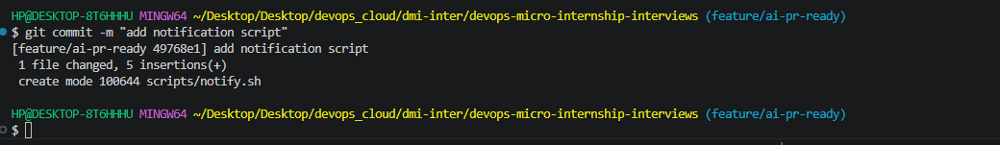
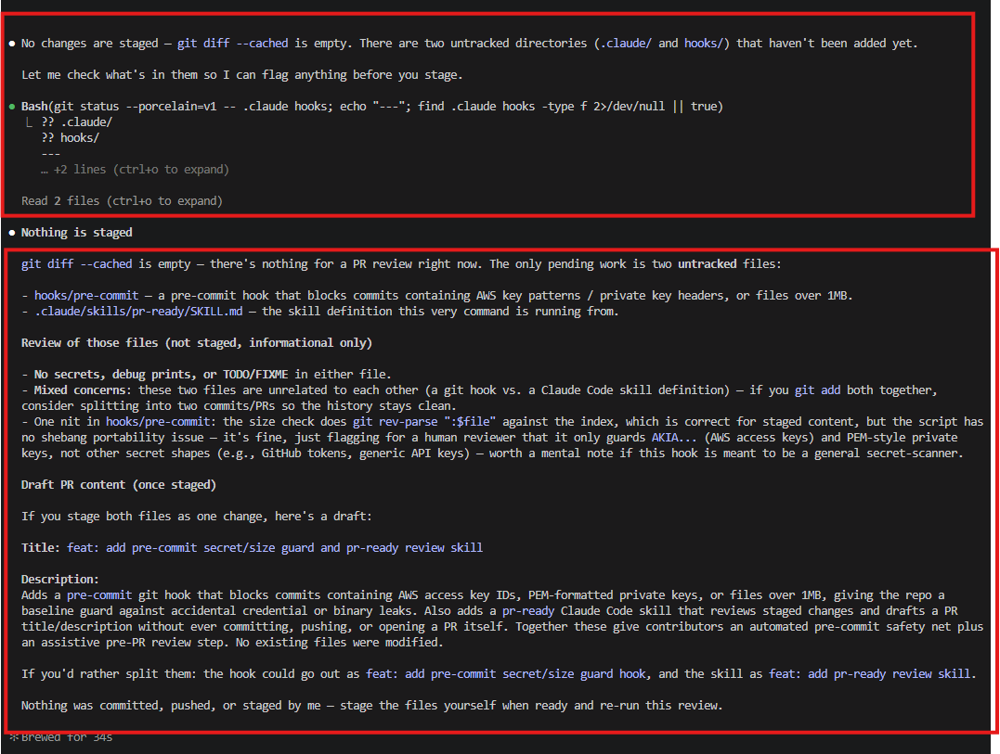
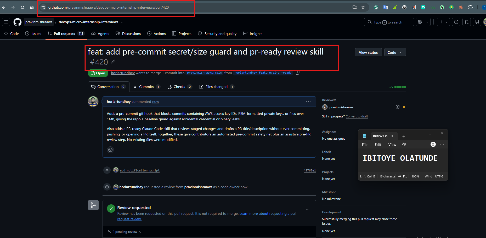

# Assignment 6 — Building an AI-Assisted Git Safety Net (PR Ready Check)

Part of the DevOps Micro Internship (DMI) Cohort 3 with Agentic AI

---

## Purpose

In Week 2 you built Claude Code hooks that block a dangerous action *before* it happens (`PreToolUse`), and a restricted skill that could look but not touch (`allowed-tools` without `Write`). In this assignment you will discover that Git has the exact same idea, decades older: a **pre-commit hook** that blocks a commit before it's created.

You will build both halves of a real "PR Ready" workflow:

1. A **Git hook that follows fixed rules** — scans staged changes for hardcoded secrets and oversized files and refuses the commit. No AI involved, no guessing, just a rule that gives the same answer every time.
2. A **restricted Claude Code skill** (`/pr-ready`) that reads your staged diff and drafts a Pull Request title, description, and a short list of things worth a second look — the kind of judgment a fixed rule can't make (mixed changes, missing context, unclear intent). The skill never commits, pushes, or opens the PR. You do that yourself, using its draft as a starting point.

This mirrors the Agentic Loop from Week 3's Linux triage assignment: **Gather → Analyze → Human Act → Verify**. The hook and the skill both gather and analyze; only you act.

---

# Task 0 — Confirm Your Fork and Create a Feature Branch

## Goal

Confirm you are working in your own fork, then create a dedicated branch for this assignment.

### Evidence

#### Screenshot 1 — Output of git remote -v and git branch showing the new branch

---

### Notes

**1. Why create a dedicated branch instead of doing this work on main?**

Creating a separate branch keeps your work isolated from the main branch. This allows you to develop, test, and make changes safely without affecting the stable version of the project. 

---

# Task 1 — Stage a Change With Realistic Risk

## Goal

On your own fork of this repository (the one you've been submitting your DMI work in since onboarding), create a new branch and stage a change that a real reviewer should catch: a hardcoded-looking secret and a leftover debug statement.

### Evidence

#### Screenshot 1 — Output of  `git status` showing the staged file on feature/ai-pr-ready

---

### Notes

**1. Why does this assignment use an obviously fake key instead of a real one?**

This creates a realistic test case for the rest of the assignment. The staged file contains common security issues that the pre-commit hook and Claude Code skill are expected to detect before the code is committed, demonstrating how automated checks can help prevent sensitive information and debugging code from being pushed to a repository.

---

# Task 2 — Write a Real Git Pre-Commit Hook

## Goal

Create a tracked, shareable pre-commit hook that blocks a commit containing secret-like patterns or files over 1MB.

### Evidence

#### Screenshot 2 — `hooks/pre-commit` open in VS Code showing the full script

---

#### Screenshot 3 — Output of `git config core.hooksPath` confirming it points to `hooks`

---

### Notes

**1. Why is `hooks/pre-commit` tracked in the repo instead of living only in `.git/hooks/`?**

`.git/hooks/` is local-only — it's inside the `.git` directory, which Git never clones, pushes, or pulls, so a hook placed there stays on one developer's machine and disappears for everyone else who clones the repo. Tracking `hooks/pre-commit` as a regular file in the project and pointing `core.hooksPath` at it makes the safety net part of the codebase itself: it's version-controlled, reviewable in Pull Requests, and every teammate who clones the repo and sets `core.hooksPath` gets the exact same protection, instead of everyone having to remember to recreate the hook by hand.

---

**2. Compare this to `PreToolUse` from Week 2 Assignment 6. What does each one intercept, and what do they have in common?**

`PreToolUse` intercepts Claude Code about to run a tool — for example a `Bash` or `Write` call — and can block it before it executes. `hooks/pre-commit` intercepts Git about to create a commit, and can block it before the commit is written to history. They operate in different systems (an AI agent's tool calls vs. Git's commit process) but share the same core idea: both are a fixed checkpoint that runs automatically *before* a potentially risky action completes, inspects what's about to happen, and can refuse it outright rather than relying on the human or the AI to remember to check manually. In both cases the check is deterministic and runs every single time, regardless of who or what triggered the action.

---

# Task 3 — Prove the Hook Blocks the Risky Commit

## Goal

Attempt to commit the staged file from Task 1 and show the hook rejecting it.

### Evidence

#### Screenshot 4 — Terminal showing `git commit` rejected with the hook's "BLOCKED" message naming the exact file

---

### Notes

**1. Which line in `hooks/pre-commit` matched your fake key, and why did it match?**

- if git diff --cached -- "$file" | grep -qE 'AKIA[0-9A-Z]{16}|-----BEGIN (RSA|OPENSSH|PRIVATE) KEY-----'; then
It matched because the fake key was intentionally written in the format of an AWS access key ID: it began with AKIA followed by 16 uppercase letters or numbers. The pre-commit hook uses grep -qE with this regular expression to scan the staged changes for that known secret-like pattern. When the pattern was found, the hook printed a BLOCKED message and exited with status code 1, causing Git to reject the commit.

---

**2. Could this hook have caught a poorly-named variable that stores a secret without the `AKIA` prefix? What does that tell you about the limits of a fixed rule like this?**

No. The hook would not necessarily catch a poorly named variable containing a secret if the value did not match one of its predefined patterns, such as:

AKIA[0-9A-Z]{16}

For example, a secret stored in something like:

API_KEY="some-random-secret-value"

could pass the hook if it did not contain an AWS-style key or private-key header.

This shows the limitation of fixed-rule checks: they are fast and reliable for the exact patterns they are programmed to detect, but they do not understand context or recognize every possible way a secret can be written. That is why the AI-assisted /pr-ready review is useful as a second layer of analysis.

---

# Task 4 — Build the `/pr-ready` Skill

## Goal

Create a manually invoked Claude Code skill that reads your staged changes and produces a PR-readiness report and a draft PR description — without writing, committing, or pushing anything itself.

### Evidence

#### Screenshot 5 — `SKILL.md` frontmatter showing `allowed-tools: Bash, Read, Grep` (no `Write`) and `disable-model-invocation: true`

---

#### Screenshot 6 — `/pr-ready` output while the risky file is still staged, showing it flagged the secret and/or debug statement

---

### Notes

**1. Why does `/pr-ready` have `Bash` and `Read` but not `Write`?**

/pr-ready has Bash and Read but not Write because it is designed to be a read-only analysis and reporting skill.

---

**2. The pre-commit hook and `/pr-ready` both looked at the same staged diff. Did they flag the same things? What did one catch that the other didn't?**

They overlapped on the fake secret: the hook's `AKIA[0-9A-Z]{16}` pattern matched it and blocked the commit, and `/pr-ready` independently flagged the same value as a likely hardcoded credential. Where they diverged was the debug statement — the pre-commit hook only checks for secret-like regex patterns and oversized files, so a leftover `console.log`/`print` debug line isn't something its fixed rules look for at all, and it passed through silently. `/pr-ready` caught it because it reasons about the diff contextually rather than matching a fixed pattern, so it could recognize the line as debug output that shouldn't ship in a PR. This is exactly the gap the fixed rule can't close on its own.

---

# Task 5 — Fix the Issues and Re-Verify

## Goal

Remove the secret and debug statement, then prove both gates now pass clean.

### Evidence

#### Screenshot 7 — `git commit` succeeding after the fix (no BLOCKED message)

---

#### Screenshot 8 — Second `/pr-ready` run showing a clean risk report and a drafted PR title + description

---

### Notes

**1. What exactly did you change to satisfy the pre-commit hook?**

I reopened `scripts/notify.sh` and removed the two things the hook and `/pr-ready` had flagged: the hardcoded AWS-style key (matching the `AKIA[0-9A-Z]{16}` pattern) and the debug `echo` statement that printed it out. After staging the corrected file and committing again, the pre-commit hook ran its `grep` check against the new diff, found no matching secret pattern, and let the commit through with no `BLOCKED` message.

---

# Task 6 — Push and Open a Pull Request Using the AI Draft

## Goal

Push your branch and open a real Pull Request, using `/pr-ready`'s drafted title and description as your starting point — read it critically and edit before you use it.

**Important:** Open this Pull Request with base repository set to **your own fork** — not the shared upstream `pravinmishraaws/devops-micro-internship-pravinmishra` repository. This assignment's hook and skill files are your own practice work, not a change meant for the shared class repo.

### Evidence

#### Screenshot 9 — Your Pull Request showing the base repository is your own fork, plus the title and description, with the `/pr-ready` draft visible for comparison (paste it in the PR conversation or your notes below)

---

#### PR Link

`https://github.com/pravinmishraaws/devops-micro-internship-interviews/pull/420`

---

### Notes

**1. What, if anything, did you edit in the AI's drafted PR description before using it? Why?**

I used `/pr-ready`'s drafted title and description as-is. After reading it critically, I found it already accurately summarized the changes — the fixed `notify.sh` script, the new `hooks/pre-commit` hook, and the `pr-ready` skill itself — so there was nothing inaccurate or missing that needed correcting before pasting it into the Pull Request.

---

**2. If you had blindly copy-pasted the AI's draft without reading it, what could go wrong?**

The AI is drafting from the staged diff without full knowledge of my intent, so a blind copy-paste risks a title or description that misrepresents the change, omits context a reviewer needs, or glosses over something that actually matters (for example, calling a security fix a routine update). Since `/pr-ready` never sees the final state I chose to ship, it could also reference details that no longer apply if I made further edits after generating the draft. Skipping the read-and-verify step defeats the whole point of keeping a human in the loop — the PR description becomes the project's permanent record of what changed and why, and an unreviewed AI draft could quietly introduce inaccuracies into that record.

---

**3. Why does this PR need to target your own fork instead of the shared upstream repository?**

The files in this PR — `hooks/pre-commit`, `.claude/skills/pr-ready/SKILL.md`, and the fixed `scripts/notify.sh` — are practice artifacts built for this assignment, not a contribution meant for the shared class repository. Opening the PR against `pravinmishraaws/devops-micro-internship-interviews` (upstream) would mix personal exercise work into a repo other students and the instructor share, cluttering its history and PR list with changes that have no value to anyone else. Targeting my own fork keeps the exercise contained to my own copy of the repository, which is exactly where this kind of self-contained practice work belongs.

---

# Task 7 — Map the Workflow to the Agentic Loop

## Goal

Explain this assignment's workflow using the same Gather → Analyze → Human Act → Verify structure from Week 3.

### Notes

**1. Which step(s) represent Gather?**

The Gather stage is represented primarily by Task 0, Task 1, and Task 4.

Task 0: `git branch` and `git remote -v` gather information about the current branch and repository remotes.
Task 1: `git status` and `git diff --cached` identify the staged files and the exact changes that are about to be committed.
Task 4: The `/pr-ready` skill gathers information from the staged changes using commands such as `git diff --cached` and `git status`.

The purpose of Gather is to collect the relevant evidence before making a decision.

---

**2. Which step(s) represent Analyze?**

The Analyze stage is represented by Task 2 and Task 4.

In Task 2, the fixed-rule pre-commit hook analyzes the staged changes using predefined rules. It checks for known secret-like patterns, such as AWS access key patterns and private key headers, and also checks whether staged files exceed the 1MB limit.

In Task 4, the `/pr-ready` Claude Code skill performs a broader AI-based review of the staged changes. It analyzes the changes for possible secrets, debug statements, TODO comments, undocumented or mixed changes, and other issues that could affect Pull Request readiness.

The pre-commit hook provides deterministic rule-based analysis, while the AI skill provides contextual analysis and explanations.

---

**3. Which step is Human Act, and why must a human — not Claude — run `git commit`, `git push`, and open the PR?**

The Human Act stage is represented by Task 5 and Task 6.

In Task 5, the human reviews the findings from the pre-commit hook and `/pr-ready`, decides how to fix the issues, edits `scripts/notify.sh`, stages the corrected file, and commits the changes.

In Task 6, the human pushes the branch to GitHub and opens the Pull Request after reviewing and critically editing the AI-generated title and description.

A human must run `git commit`, `git push`, and open the Pull Request because these actions change the project's history or shared external state. The AI can provide analysis and recommendations, but the human must remain responsible for approving and executing consequential actions. This prevents an AI tool from independently committing changes, pushing potentially incorrect code, or opening a Pull Request without human review.

---

**4. Which step is Verify?**

The Verify stage is represented primarily by Task 5.

After fixing the hardcoded secret-like value and removing the debug statement, the changes are staged again and the commit is retried. The pre-commit hook runs again and confirms that the fixed-rule checks pass.

The `/pr-ready` skill is also run again to review the corrected staged changes. A clean result from both checks provides evidence that the identified issues have been resolved before the work is pushed and submitted for review.

---

**5. In one or two sentences: why do you need *both* the fixed-rule pre-commit hook and the AI skill? Isn't one enough?**

The fixed-rule pre-commit hook and the AI skill serve different purposes, so one is not enough. The hook provides fast, consistent enforcement of known rules, while the AI skill provides contextual reasoning and can identify issues that fixed patterns may not detect. Together, they provide both deterministic protection and broader human-like analysis before the developer takes action.

This assignment demonstrates the same Gather → Analyze → Human Act → Verify loop from the previous assignment: information is collected, automated and AI tools analyze it, the human decides and acts, and the results are checked again before external changes are made.

---

# Task 8 — LinkedIn Post

## Goal

Publish a LinkedIn post summarizing what you built and what you learned about combining fixed-rule safety checks with AI-assisted review.

### Evidence

#### LinkedIn Post URL

`https://www.linkedin.com/posts/olatunde-ibitoye_dmibypravinmishra-git-github-activity-7486772307131195392-7KBG?utm_source=share&utm_medium=member_desktop&rcm=ACoAAB_xj1QBIy4RnDuKMoQp8yo4i8QCKxf266A`

---

## Key Learnings

- A fixed-rule pre-commit hook and an AI-based review skill solve different problems: the hook gives fast, deterministic enforcement of known patterns, while the AI skill provides contextual judgment for things a fixed rule can't anticipate.
- Tracking `hooks/pre-commit` in the repo (instead of leaving it only in `.git/hooks/`) makes the safety net shareable across the whole team, not just a local convenience on one machine.
- Restricting `/pr-ready` to `Bash`, `Read`, and `Grep` (no `Write`) enforces the same "look but don't touch" boundary from Week 2 — the skill can analyze and draft, but it can never commit, push, or modify files itself.
- Consequential, history-changing actions like `git commit`, `git push`, and opening a Pull Request must stay a human decision — AI can gather and analyze, but a person has to be the one who acts and is accountable for the outcome.
- The Gather → Analyze → Human Act → Verify loop from Week 3 applies just as well to a Git safety-net workflow as it did to Linux triage, reinforcing that it's a general pattern for combining automation with human oversight.

---

# Submission Instructions

- Ensure `hooks/pre-commit` and `.claude/skills/pr-ready/SKILL.md` are committed to your GitHub repository
- Add all required screenshots to your submission
- All written answers must be in your own words
- Do not use a real secret or credential anywhere in your submission — the fake key in Task 1 is intentional and must stay clearly fake
- Open your Pull Request against your own fork, not the shared upstream repository
- Push your final changes to your forked repository
- Include your PR link and LinkedIn post URL

---

## GitHub Repository URL

Paste your forked repository URL here:

`https://github.com/horlartundhey/devops-micro-internship-interviews`

---

# Completion Checklist

- [ ] Branch `feature/ai-pr-ready` created with a staged file containing a fake secret and a debug statement
- [ ] `hooks/pre-commit` created and tracked in the repo (not only in `.git/hooks/`)
- [ ] `core.hooksPath` configured to point at `hooks/`
- [ ] Pre-commit hook shown blocking the risky commit
- [ ] `.claude/skills/pr-ready/SKILL.md` created with correct `allowed-tools` (no `Write`) and `disable-model-invocation: true`
- [ ] `/pr-ready` run against the risky diff and shown flagging issues
- [ ] Risky file fixed; `git commit` succeeds cleanly
- [ ] `/pr-ready` re-run showing a clean report and drafted PR title/description
- [ ] Pull Request opened using the AI draft as a starting point, with your own fork as the base repository (not upstream), PR link included
- [ ] Agentic Loop mapping (Task 7) completed in your own words
- [ ] LinkedIn post published and URL submitted
- [ ] All required screenshots added
- [ ] GitHub repository URL provided

---

## 📌 About DMI & CloudAdvisory

DevOps Micro Internship (DMI) is a project-based DevOps program run by Pravin Mishra (The CloudAdvisory) focused on real-world execution, systems thinking, and career readiness.

It helps learners build strong DevOps foundations with hands-on experience.

---

## 📌 Resources

- 🌐 DMI Official Website: https://pravinmishra.com/dmi  
- 🎓 DevOps for Beginners (Udemy): https://www.udemy.com/course/devops-for-beginners-docker-k8s-cloud-cicd-4-projects/  
- 🎓 Agentic AI DevOps with Claude Code: https://www.udemy.com/course/ultimate-agentic-ai-devops-with-claude-code/  
- 🎓 DevOps with Claude Code: Terraform, EKS, ArgoCD & Helm: https://www.udemy.com/course/devops-with-claude-code-terraform-eks-argocd-helm/  
- ▶️ YouTube Playlist: https://www.youtube.com/playlist?list=PLFeSNDtI4Cho  
- 🔗 Pravin Mishra (LinkedIn): https://www.linkedin.com/in/pravin-mishra-aws-trainer/  
- 🏢 CloudAdvisory (LinkedIn): https://www.linkedin.com/company/thecloudadvisory/

---

*This submission is part of DevOps Micro Internship (DMI) Cohort 3 — Agentic AI Track.*
