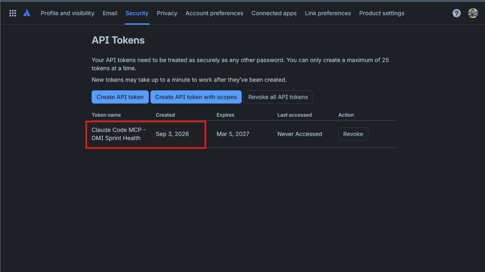
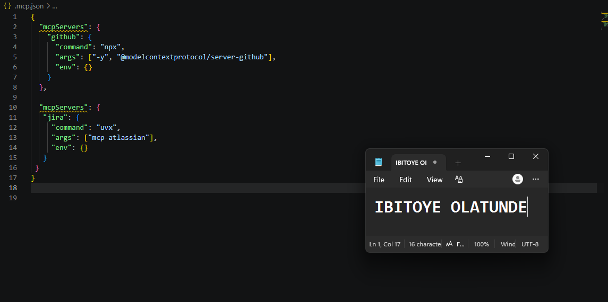
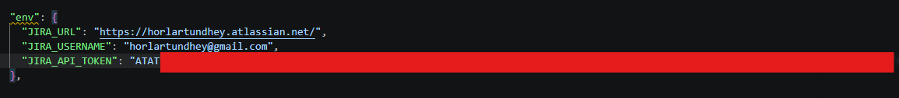
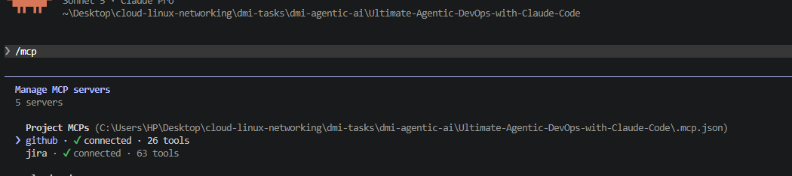
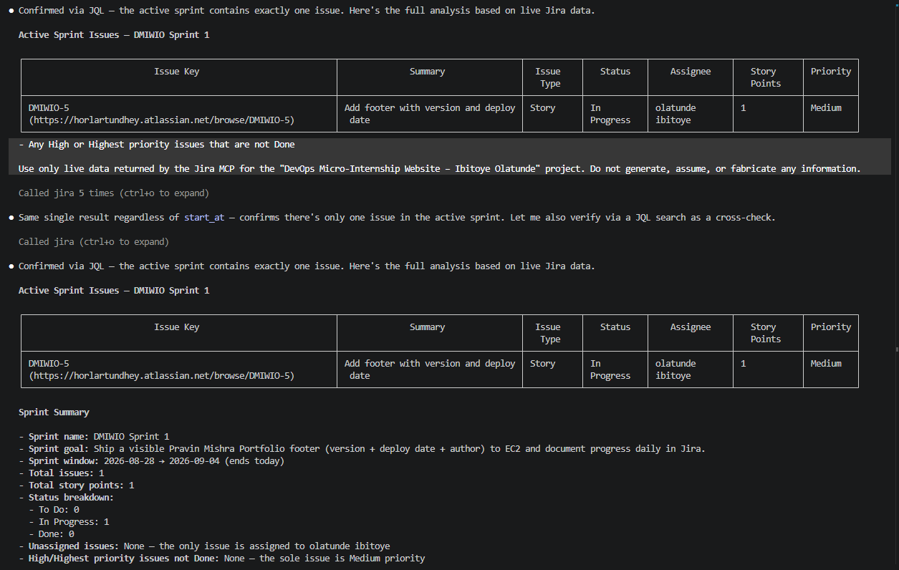
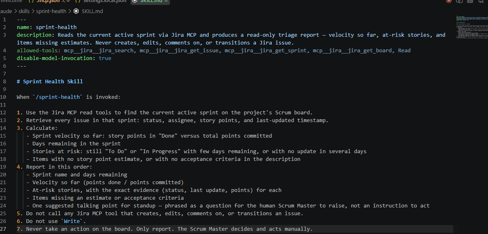
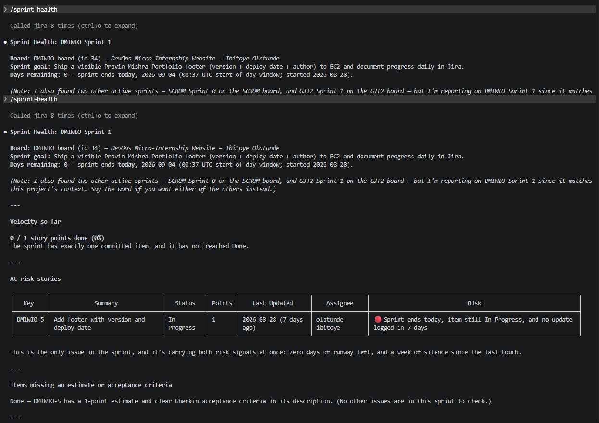
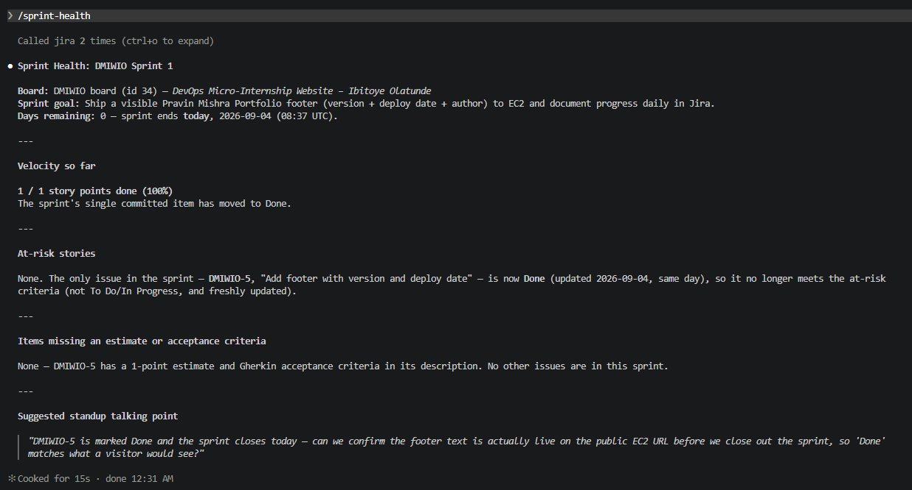

# Assignment 5 — AI-Assisted Sprint Health Report via Jira MCP

Part of the DevOps Micro Internship (DMI) Cohort 3 with Agentic AI

---

## Purpose

In this assignment, you will connect Claude Code to your Jira board through an MCP server, the same way you connected it to GitHub in Week 2, and build a read-only `/sprint-health` skill. The skill reads your current sprint through Jira's API and reports sprint velocity, stories at risk of missing the sprint, and items missing an estimate — but it must never create, edit, comment on, or transition a single ticket itself. You will prove that boundary holds by making a real change on the board yourself and confirming the skill only ever reports, never acts.

---

# Task 1 — Create a Jira API Token

## Goal

Generate an API token from your Atlassian account that the MCP server will use to authenticate with your Jira site. Do not screenshot the token value itself.

### Evidence

#### Screenshot 1 — Jira API token creation confirmation page showing the token name, with the token value not visible

### Notes You Must Write (Very Important):

Why does the MCP server need your site URL and account email in addition to the token?

jira's REST API authenticates using Basic Auth, which requires a username (your email) and a secret (the API token) together — the token alone doesn't identify which Atlassian account it belongs to or which Jira site to connect to, since Atlassian hosts many separate instances (your-site.atlassian.net is yours specifically, distinct from anyone else's). The token proves "this really is you," the email says "on behalf of this specific account," and the URL says "talk to this specific Jira instance, not some other one."

---

# Task 2 — Create .mcp.json at the Project Root

## Goal

Create or update `.mcp.json` at your project root with a Jira MCP server block, following the same shape as the GitHub MCP server you configured in Week 2.

### Evidence

#### Screenshot 2 — `.mcp.json` open in VS Code showing the Jira server configuration

### Notes You Must Write (Very Important):

Compare this jira block to the github block from Week 2 Assignment 5. The GitHub server ran via npx (a Node.js package); this one runs via uvx (a Python package) — what stays exactly the same shape despite that difference, and why doesn't Claude Code care which language a given MCP server is written in?

Only the launcher and package arguments differ. Claude Code starts each MCP server as an external process and communicates with it through the standard MCP protocol, typically over standard input/output. It does not inspect or depend on the server’s implementation language. Therefore, a Node.js server launched with npx and a Python server launched with uvx look identical from Claude Code’s perspective: both expose MCP tools through the same protocol.

---

# Task 3 — Add Your Credentials to settings.local.json

## Goal

Add your Jira site URL, account email, and API token to `.claude/settings.local.json`, and confirm that file is listed in `.gitignore` so it is never committed.

### Evidence

#### Screenshot 3 — `settings.local.json` open in VS Code showing the `env` section, with the actual token value blurred or covered

### Notes You Must Write (Very Important):

JIRA_API_TOKEN is a secret credential. It belongs in settings.local.json because that file is intended for machine-specific, private configuration and should be excluded from Git.

.mcp.json is the server registration file and may be committed or shared. Putting the token there could expose it through source control, backups, pull requests, or logs. The MCP definition should contain only startup metadata:

Claude Code can combine the server definition from .mcp.json with local environment values from settings.local.json when launching Jira.

---

# Task 4 — Verify the Connection with /mcp

## Goal

Restart Claude Code and confirm the Jira MCP server shows as connected.

### Evidence

#### Screenshot 4 — `/mcp` output showing `jira: connected`

---

# Task 5 — Run a Live Query to Prove Real Board Data

## Goal

Ask Claude to list the issues in your current active sprint through the Jira MCP connection, and confirm the result matches what you see on your live board in the browser.

### Evidence

#### Screenshot 5 — Claude's response showing the live sprint issue list retrieved via Jira MCP

### Notes You Must Write (Very Important):

How did you confirm this was real board data and not something Claude guessed?

  1. Resolved the project by name, not assumption — jira_search_projects("DevOps Micro-Internship") hit your real Jira Cloud site (horlartundhey.atlassian.net) and returned
     project key DMIWIO, id 10033. I didn't hardcode a key; I looked it up.
  2. Found the board and sprint through the actual hierarchy — jira_get_agile_boards(project_key=DMIWIO) → board 34 ("DMIWIO board"). Then
     jira_get_sprints_from_board(board_id=34, state=active) → sprint 68 ("DMIWIO Sprint 1"), which came with real metadata (goal text, start/end timestamps: 2026-08-28 to
     2026-09-04) — that's server-generated content, not something a model would fabricate to look plausible.
  3. Pulled issues via the sprint-issues endpoint — jira_get_sprint_issues(sprint_id=68) returned one issue, DMIWIO-5, with a real Atlassian internal ID (10041), an account_id
     for the assignee, and a browse_url (https://horlartundhey.atlassian.net/browse/DMIWIO-5) that's a live link you can click and land on the actual issue.
  4. Cross-verified with a completely different query path — instead of trusting the sprint-issues call alone, I re-ran it via raw JQL (project = DMIWIO AND sprint = 68) using
     jira_search. That hits a different Jira REST endpoint under the hood. It returned the exact same single issue with identical field values — so two independent API paths
     agree, which rules out a fluke of one endpoint's caching or a truncated response.
  5. Checked for pagination gaps — I also called jira_get_sprint_issues with start_at=1 to make sure a second page of results wasn't being hidden; it returned the same single
     record, confirming there's genuinely only one issue rather than a limit cutoff hiding others.

---

# Task 6 — Build the /sprint-health Skill

## Goal

Create a `/sprint-health` skill restricted to read-only Jira tools plus `Read`, with no issue-mutating tools and no `Write`. Run it and confirm it produces a report covering sprint velocity, at-risk stories, and items missing an estimate.

### Evidence

#### Screenshot 6 — `SKILL.md` frontmatter showing `allowed-tools` limited to read-only Jira tools plus `Read`, with `disable-model-invocation: true`

#### Screenshot 7 — `/sprint-health` output showing the full triage report against your real sprint

### Notes You Must Write (Very Important):

1. Which Jira MCP tools does this skill's allowed-tools list include, and which mutating tools (create issue, update issue, transition issue, add comment) does it deliberately exclude?

2. Why does a Scrum Master need this restriction more than almost any other role in this course?

Read-Only Restriction on the sprint-health Skill

  1. Allowed vs. excluded tools

  From the skill's frontmatter (allowed-tools: in SKILL.md):

  - Included (read-only): mcp__jira__jira_search, mcp__jira__jira_get_issue, mcp__jira__jira_get_sprint, mcp__jira__jira_get_board, plus the local Read tool. Everything the
    skill does — finding the active sprint, pulling issue status/assignee/points/last-updated, checking descriptions for acceptance criteria — is done with these four Jira
    calls alone.
  - Deliberately excluded (mutating): every Jira MCP tool that changes state is left off the list and is explicitly forbidden in the skill's own instructions (step 5). That
    includes, among others:
    - jira_create_issue / jira_batch_create_issues
    - jira_update_issue, jira_transition_issue, jira_move_issue, jira_move_issues_to_backlog
    - jira_add_comment, jira_edit_comment
    - jira_assign_issue, jira_add_watcher, jira_remove_watcher
    - jira_add_worklog, jira_create_issue_link, jira_link_to_epic, jira_create_sprint, jira_update_sprint, etc.

    The skill also bans the generic Write tool (step 6), so it can't even write a file to disk — the only output channel is the chat report itself.

  2. Why this restriction matters more for a Scrum Master than almost any other role

  - The Scrum Master doesn't own the artifacts on the board — the team does. In Scrum, status, estimates, and comments are supposed to be self-reported by the person doing the
    work. If an assistant acting "as the Scrum Master" started transitioning tickets or leaving comments, it would substitute an inference for the team member's own report —
    corrupting the very signal (velocity, burndown, status accuracy) that sprint health depends on.
  - The SM's tool touches shared, board-wide state, not personal work. A developer's assistant editing code or updating their own ticket affects one person's artifact. A Scrum
    Master's assistant sits in front of the entire team's system of record — a bad auto-transition or a misplaced comment doesn't just mislead one person, it silently
    misinforms everyone who reads the board afterward, and is hard to trace back to "the AI did it."
  - The SM's job is to surface risk, not resolve it. The whole point of a sprint-health check is diagnostic: find at-risk stories and hand them to a human for a judgment call
    at standup. If the tool could also act (e.g., "helpfully" mark a stale ticket Done, or transition something back to To Do), it would be making the exact judgment calls that
    are supposed to stay with the team — and could paper over the risk it was built to expose.
  - Trust in the board depends on humans being the only writers. Scrum's self-organization principle only works if everyone can trust that status reflects what the team
    actually did. A read-only tool preserves that guarantee; a mutating one — even with good intentions — turns the Scrum Master's reporting aid into an unaccountable actor on
    shared state, which is a much bigger blast radius than almost any other course role's tooling touches.

---

# Task 7 — Prove the Skill Never Mutates the Board

## Goal

Manually update one ticket on your board in the browser (for example, move a story to "Done" or add a missing estimate), then run `/sprint-health` again and confirm the new report reflects your change — proving the skill only ever reads live state and never wrote to the board itself.

### Evidence

#### Screenshot 8 — Second `/sprint-health` run showing the report now reflects your manual board change

### Notes You Must Write (Very Important):

Map this assignment to Gather → Analyze → Human Act → Verify from Week 3 Assignment 6. Which step did you perform manually in the browser, and why must that step stay human?

Gather
  The /sprint-health skill pulled raw state from Jira using only read tools — jira_get_sprints_from_board (found the active sprint, its goal, start/end dates) and
  jira_get_sprint_issues (pulled DMIWIO-5's status, assignee, points, description, last-updated timestamp). This is pure data collection: nothing was interpreted or judged yet.

  Analyze
  I (the assistant) turned that raw data into a diagnosis: velocity (0/1 → later 1/1), zero days remaining, at-risk flags on the first run (In Progress + stale + sprint ending
  same day), and a check for missing estimates/acceptance criteria. This step produces a read-only report and a suggested standup question — it stops short of any conclusion
  like "this is fine, close the sprint."

  Human Act
  Between my first run and this second run, DMIWIO-5's status changed from In Progress to Done. The skill never called a mutating tool (jira_transition_issue isn't even on its
  allowed-tools list), so that transition had to happen the only other way it could: you moved the card manually in the Jira web UI/board — dragging it to Done or using the
  issue's status dropdown in the browser. That's the step performed manually.

  Verify
  This second /sprint-health invocation is the verify step — re-gathering and re-analyzing to confirm the transition actually landed (status now Done, updated today, velocity
  now 100%, at-risk list now empty). The talking point I surfaced ("can we confirm the footer text is actually live on the public EC2 URL") is itself pushing verification one
  level deeper: Jira saying "Done" is not the same as the real-world artifact (the deployed footer) being correct.

  Why the Human Act step must stay human
  The transition from In Progress → Done is an assertion that real, external work is complete and correct — that the footer text actually renders on the live EC2 URL exactly as
  the acceptance criteria specify. That's not something derivable from Jira's own data; it requires someone to have looked at the actual deployed site (or run the deploy) and
  judged it against the Gherkin scenario. An agent with write access to Jira could flip the status without ever checking the real system, producing a board that says Done while
  the site is wrong — a false signal that's worse than no signal, because it stops the team from looking further. Keeping that one step manual is what forces a human to
  actually verify reality before the system of record is allowed to change, which is exactly why this skill's tool list has no transition/comment/edit tools at all — the
  restriction and this human checkpoint are the same control, enforced twice.

---

# Submission Instructions

Complete all tasks in sequence.

Your submission must include:
- All 8 required screenshots
- All the required notes

---

# Completion Checklist

- [x] Task 1: Jira API token created, value never screenshotted (Screenshot 1)
- [x] Task 2: `.mcp.json` has the Jira server block (Screenshot 2)
- [x] Task 3: Credentials stored in `settings.local.json`, token blurred, file gitignored (Screenshot 3)
- [x] Task 4: `/mcp` shows the Jira server connected (Screenshot 4)
- [x] Task 5: Live query returned real sprint data, verified against the browser (Screenshot 5)
- [x] Task 6: `/sprint-health` skill created with correct read-only `allowed-tools`, and produced a full report (Screenshots 6–7)
- [x] Task 7: A manual board change was reflected in a second `/sprint-health` run (Screenshot 8)
- [x] Skill never created, edited, transitioned, or commented on any issue
- [x] Reflection answered (Notes)
- [x] No API token value exposed

---

## 📌 About DMI & CloudAdvisory

DevOps Micro Internship (DMI) is a project-based DevOps program run by Pravin Mishra (The CloudAdvisory) focused on real-world execution, systems thinking, and career readiness.

It helps learners build strong DevOps foundations with hands-on experience.

---

## 📌 Resources

- 🌐 DMI Official Website: https://dmi.pravinmishra.com?utm_source=github&utm_medium=readme  
- 🎓 University: https://university.pravinmishra.com?utm_source=github&utm_medium=readme  
- 💬 Discord Community: https://discord.pravinmishra.com?utm_source=github&utm_medium=readme  
- 📝 Blog: https://dmi.pravinmishra.com/blog?utm_source=github&utm_medium=readme  
- ▶️ YouTube Playlist: https://www.youtube.com/playlist?list=PLFeSNDtI4Cho  
- 🔗 Pravin Mishra (LinkedIn): https://www.linkedin.com/in/pravin-mishra-aws-trainer/  
- 🏢 CloudAdvisory (LinkedIn): https://www.linkedin.com/company/thecloudadvisory/

---

*This submission is part of DevOps Micro Internship (DMI) Cohort 3 — Agentic AI Track.*
