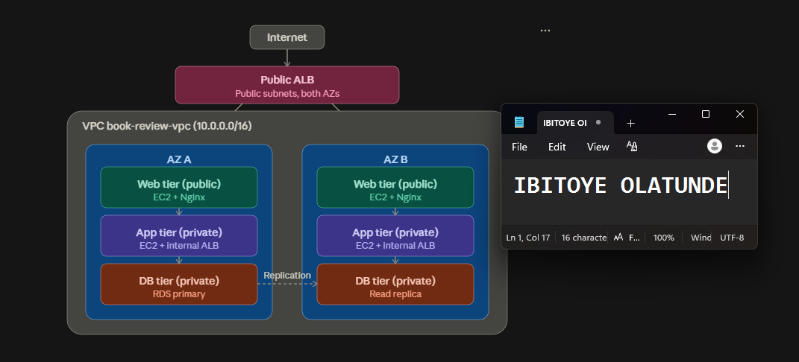
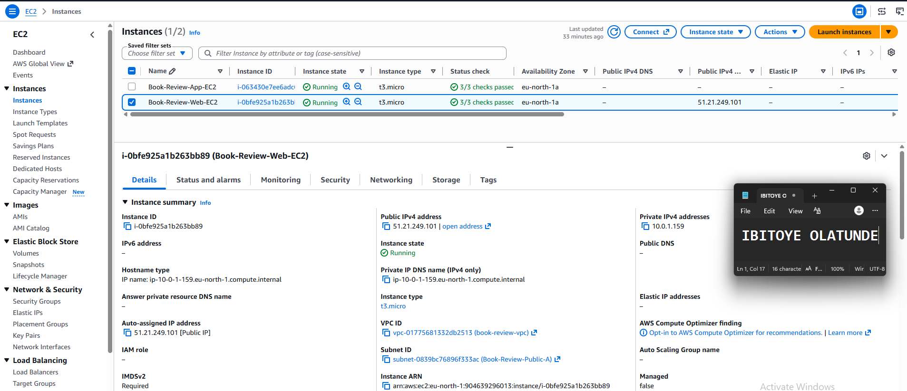
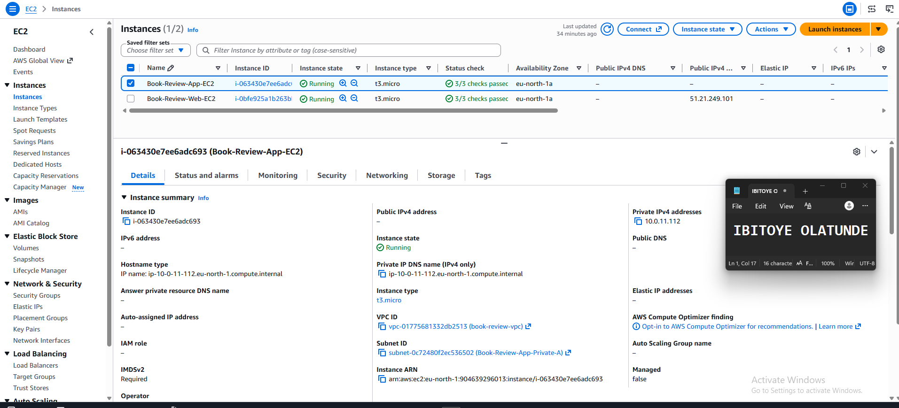
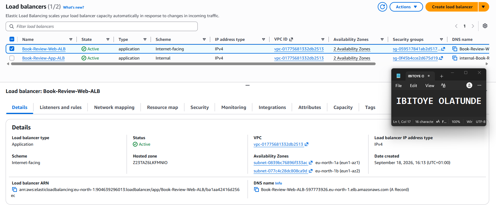
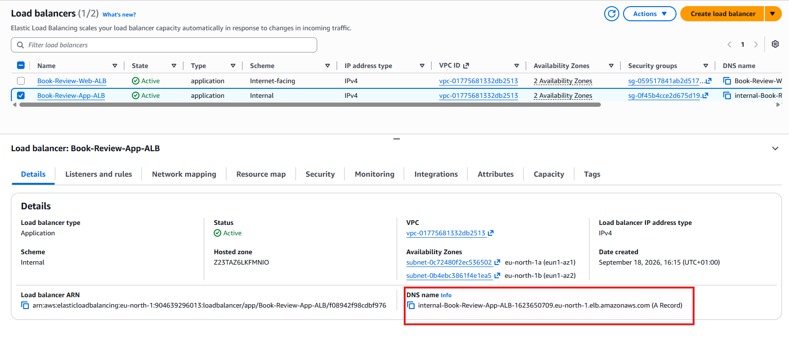
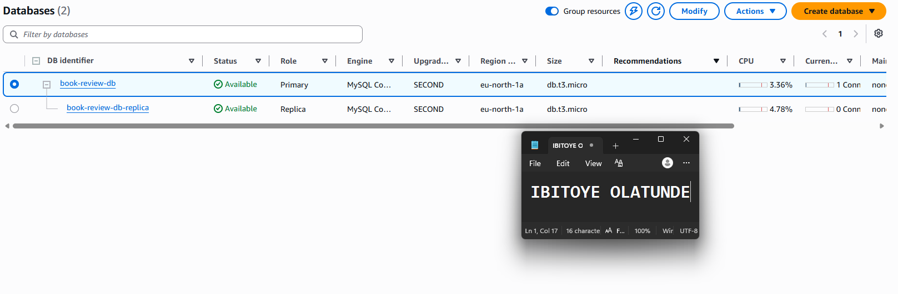
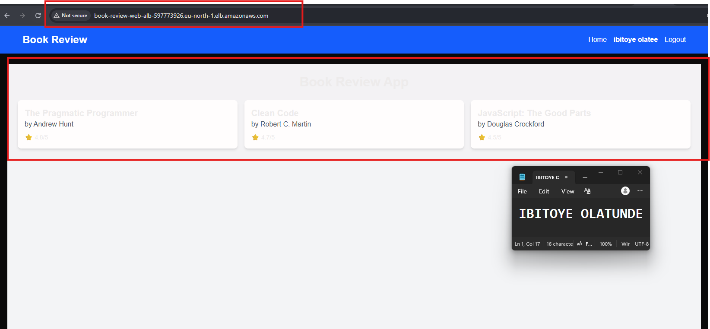
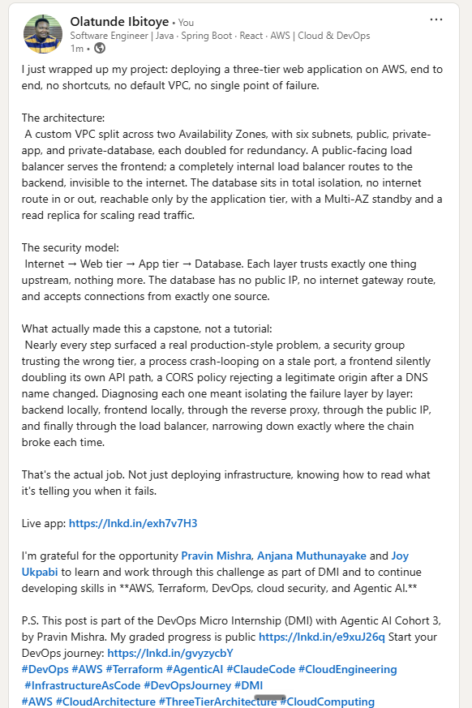

# Assignment 6 — Capstone Assignment — Deploy Book Review App (Three-Tier Architecture) on AWS

Part of the DevOps Micro Internship (DMI) Cohort 3 with Agentic AI

---

## Purpose

This is the most important assignment of the course. You will deploy the Book Review App in a fully production-style three-tier architecture on AWS: a Next.js Web Tier behind Nginx and a public ALB, a private Node.js/Express App Tier behind an internal ALB, and a private Multi-AZ MySQL RDS database with a read replica. You are expected to design, deploy, isolate, debug, and document the result independently.

---

# Task 1 — Architecture Diagram

## Goal

Create an architecture diagram showing the custom VPC (10.0.0.0/16), the six subnets across two Availability Zones (two public Web Tier, two private App Tier, two private Database Tier), the public ALB, Web Tier EC2/Nginx, internal ALB, private App Tier EC2, private Multi-AZ RDS with its read replica, and the permitted traffic flow.

### Evidence

#### Diagram image or link

---

# Task 2 — AWS Region & Services Used

## Goal

Record the AWS Region used and list every AWS service used across networking, compute, load balancing, security, and the database.

### Notes

**Region:** eu-north-1

---

**Services:**

Networking: VPC, 6 Subnets, Internet Gateway, NAT Gateway, Elastic IP, 3 Route Tables
Security: 3 Security Groups (Web, App, DB)
Compute: 2× EC2 (Ubuntu 24.04 LTS)
Load Balancing: 2× Application Load Balancer (public + internal), 2× Target Groups
Database: Amazon RDS MySQL (Multi-AZ), RDS Read Replica
Application tooling: Nginx (reverse proxy), PM2 (process manager), Node.js/npm, Git

---

# Task 3 — Public Entry Point

## Goal

Confirm the Book Review App loads through the public ALB DNS name.

### Evidence

#### Public ALB DNS

Paste your public ALB DNS name here:

`http://book-review-web-alb-597773926.eu-north-1.elb.amazonaws.com`

---

# Task 4 — Evidence Screenshots

## Goal

Capture visual proof of every tier and load balancer.

### Evidence

#### Web EC2

---

#### App EC2

---

#### Public ALB

---

#### Internal ALB

---

#### RDS + Replica

---

#### App UI proof

---

# Task 5 — Summary

## Goal

Summarize what worked in the final deployment, the issues encountered and how each was fixed, and the tools or sources used to research and debug.

### Notes

**What worked:**

The full three-tier chain is functioning end-to-end: registration and login work through the Public ALB DNS name, the frontend correctly proxies /api/* requests through Nginx to the Internal ALB, and the backend successfully connects to the private Multi-AZ RDS instance. Both EC2 tiers run under PM2 for persistence, and the security group chain (Web → App → DB) enforces that only the intended tier can reach the next.

---

**Issues + fixes:**

- VPC/subnet mismatch on instance launch — a test EC2 instance failed to launch because its security group and subnet belonged to different VPCs; fixed by explicitly re-selecting matching VPC resources.

- Self-referencing security group rule — App-SG's port 3001 rule (sourced from itself) couldn't be added during initial creation, since AWS requires the group to already exist before it can reference its own ID; fixed by creating the group first, then adding that rule in a second pass.

- RDS security group source mismatch — the database security group was initially configured to trust Web-SG instead of App-SG, causing connection timeouts from the app tier; corrected to trust App-SG, matching the intended security chain.

- Nginx proxy_pass pointing at the wrong ALB hostname — the config initially contained an example/placeholder Internal ALB DNS name rather than the actual one; corrected to the project's real Internal ALB endpoint.

- Backend EADDRINUSE crash loop — an earlier foreground test (node src/server.js) was never stopped before also starting the app under PM2, causing repeated port conflicts; resolved by clearing the stale process and starting cleanly, once, under PM2.

- /api/api/books 404 (path-doubling bug) — one frontend file called the books endpoint with a redundant /api prefix on top of the already-set NEXT_PUBLIC_API_URL=/api; fixed by correcting the single offending line and rebuilding (required, since this env var is compiled into the bundle at build time, not read at runtime).

- CORS rejection on registration — the backend's ALLOWED_ORIGINS didn't include the exact Public ALB DNS name being used for testing; fixed by adding it and restarting the backend process to reload the updated .env.

- SSH connection timeout to Web EC2 — caused by a dynamic home IP address changing after the security group's SSH rule was originally scoped to "My IP"; resolved by re-selecting "My IP" in the console to refresh the allowed address.

- Unexplained external redirect (return.st) on the frontend — briefly observed via both a direct curl to the frontend and a browser-blocked redirect attempt on the register page. Investigated for potential compromise (checked source, dependencies, build output, auth logs, and cron for signs of tampering), no conclusive source was found in the codebase or logs, and the issue did not reproduce after a clean dependency reinstall and rebuild. Flagged here rather than dismissed, since the root cause was not definitively isolated.

---

**Tools/sources used:**

AWS documentation (VPC, RDS, ALB, Security Groups), the assignment's own troubleshooting appendix (which correctly predicted several of the exact issues hit, including the CORS and path-doubling bugs), and iterative debugging via curl, pm2 logs, browser DevTools Network tab, and direct MySQL queries against RDS.

---

# LinkedIn Post (Required)

## Goal

Publish a LinkedIn post sharing the capstone deployment, including the public ALB DNS (or a redacted screenshot), three to five lines on what you built and why it is production-style, and one proof screenshot.

## Evidence

#### LinkedIn Post URL

Paste your LinkedIn post URL here:

`https://www.linkedin.com/posts/olatunde-ibitoye_devops-aws-terraform-activity-7507553500239884288-vUlV?utm_source=share&utm_medium=member_desktop&rcm=ACoAAB_xj1QBIy4RnDuKMoQp8yo4i8QCKxf266A`

---

#### Screenshot of LinkedIn post

---

# Submission Instructions

- Add all required screenshots and links in your submission
- Do not expose passwords, RDS credentials, connection strings, private keys, or account IDs

---

# Completion Checklist

- [x] Task 1: Architecture diagram completed
- [x] Task 2: AWS Region and services documented
- [x] Task 3: Public ALB DNS confirmed working
- [x] Task 4: All six evidence screenshots captured (Web Tier, App Tier, both ALBs, RDS + replica, app UI)
- [x] Task 5: Deployment summary completed (what worked, issues/fixes, tools/sources)
- [x] LinkedIn post published and URL submitted
- [ ] App Tier and Database Tier confirmed not publicly accessible
- [ ] No sensitive data exposed

---

## 📌 About DMI & CloudAdvisory

DevOps Micro Internship (DMI) is a project-based DevOps program run by Pravin Mishra (The CloudAdvisory) focused on real-world execution, systems thinking, and career readiness.

It helps learners build strong DevOps foundations with hands-on experience.

---

## 📌 Resources

- 🌐 DMI Official Website: https://dmi.pravinmishra.com?utm_source=github&utm_medium=readme  
- 🎓 University: https://university.pravinmishra.com?utm_source=github&utm_medium=readme  
- 💬 Discord Community: https://discord.pravinmishra.com?utm_source=github&utm_medium=readme  
- 📝 Blog: https://dmi.pravinmishra.com/blog?utm_source=github&utm_medium=readme  
- ▶️ YouTube Playlist: https://www.youtube.com/playlist?list=PLFeSNDtI4Cho  
- 🔗 Pravin Mishra (LinkedIn): https://www.linkedin.com/in/pravin-mishra-aws-trainer/  
- 🏢 CloudAdvisory (LinkedIn): https://www.linkedin.com/company/thecloudadvisory/

---

*This submission is part of DevOps Micro Internship (DMI) Cohort 3 — Agentic AI Track.*