# Assignment 7 — AI-Assisted AWS Security and Cost Audit

Part of the DevOps Micro Internship (DMI) Cohort 3 with Agentic AI

---

## Purpose

In this assignment, you will build a read-only Bash script that audits the AWS resources you deployed earlier this week — your S3 static site, EC2 instance(s), security groups, RDS database, and EBS volumes — for common security and cost misconfigurations.

You will then connect that script to Claude Code as a reusable `/aws-audit` skill that explains what it found and recommends a fix, without ever making the fix itself.

Finally, you will find a real misconfiguration in your own account, apply the fix yourself, and prove it worked with a second audit run.

---

# Task 1 — Confirm Your AWS Resources and Set Up Your Workspace

## Goal

Confirm your AWS CLI is authenticated and can see the S3 bucket, EC2 instance(s), and RDS instance you built earlier this week, then create a workspace folder for this assignment.

### Evidence

#### Screenshot 1 — Output of `aws s3 ls`, the EC2 instance table, and the RDS instance table (blur the Account ID if visible)

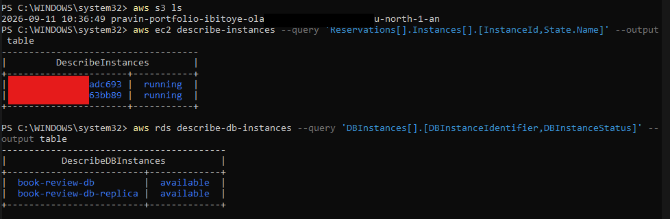

---

#### Screenshot 2 — Output of `pwd` and `find . -maxdepth 4 -type d | sort`

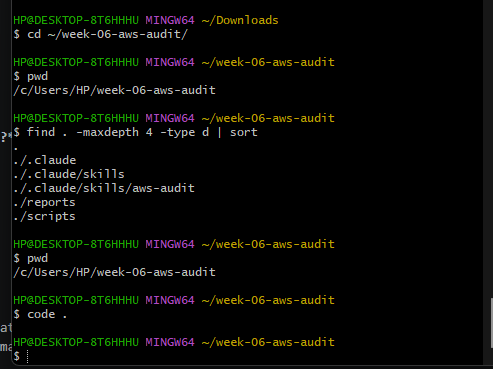

---

### Notes You Must Write (Very Important)

**1. Which resources from this week's earlier assignments did you see in the listings?**

The aws s3 ls output showed my S3 bucket from the static site assignment, the EC2 table showed my Web and App tier instances in their current state, and the RDS table showed my book-review-db instance and its status.

**2. Why must you confirm your resources exist before writing an audit script against them?**

An audit script's checks are only meaningful if they're pointed at real, existing resources. Writing checks against a bucket name, instance ID, or DB identifier that doesn't actually exist would produce false or misleading results (either silent failures or "not found" errors mistaken for a security finding), rather than genuine evidence about the account's actual posture.

---

# Task 2 — Define Safety Rules in CLAUDE.md

## Goal

Create a `CLAUDE.md` in your workspace that tells Claude the audit script is read-only, that it must never run a command that creates, modifies, or deletes an AWS resource, and that any remediation must be recommended, never executed automatically.

### Evidence

#### Screenshot 3 — `CLAUDE.md` open in VS Code showing all four sections

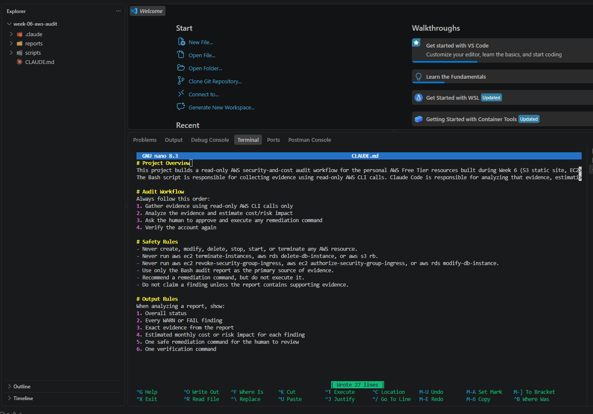

---

### Notes You Must Write (Very Important)

**1. Why should Claude never be given permission to run `revoke-security-group-ingress` itself, even if the fix is obviously correct?**

Even a "correct" fix carries real risk: removing the wrong rule, targeting the wrong security group, or misreading which port matters most could break live SSH access or another dependency that isn't visible in the audit evidence alone. Keeping a human in the loop for any state-changing action means a person with full context, not just the evidence in one report, makes the final call before anything actually changes in the account.

**2. Which rule prevents Claude from claiming a finding that the report does not support?**

"Do not claim a finding unless the report contains supporting evidence." This forces every finding Claude states to be traceable back to an actual line in aws-audit-report.txt, rather than an assumption or something inferred from general AWS knowledge.

---

# Task 3 — Plan the Audit with Claude Code

## Goal

Ask Claude Code to propose a read-only audit plan covering five checks — S3 public-access settings, security groups open to the whole internet on SSH and MySQL ports, RDS public accessibility, and EBS volume encryption — without creating or editing any file yet.

### Evidence

#### Screenshot 4 — Claude Code showing the five-check plan

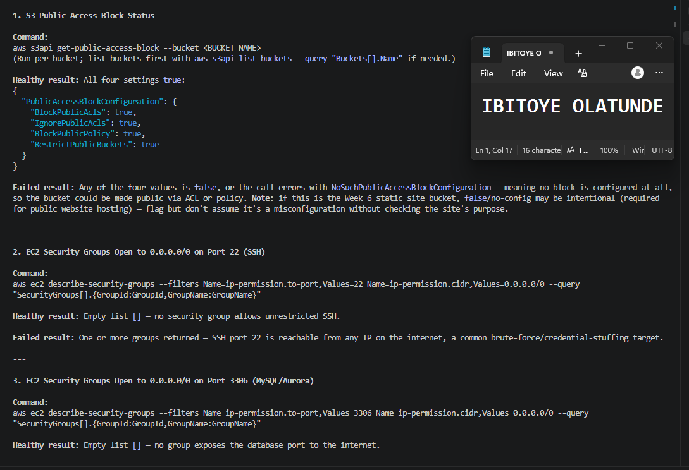

---

### Notes You Must Write (Very Important)

**1. Which part of this task represents the Gather phase?**

Asking Claude Code to propose the five-check plan, and confirming it names the exact read-only CLI commands, without creating or editing any files yet, is the Gather phase. It defines what evidence will be collected before any collection actually happens.

**2. Did every proposed command start with `describe-`, `get-`, or `list-`? Why does that matter?**

Yes, this matters because those verb prefixes are AWS's own convention for read-only, non-mutating API calls. Confirming every command falls into that category before the script is even written is a safety checkpoint: it verifies the plan itself can't accidentally introduce a state-changing command later, since the verbs were locked in before any code existed.

---

# Task 4 — Build the AWS Audit Script

## Goal

Write a Bash script that runs the five checks from Task 3 using only read-only AWS CLI calls, writes a PASS/WARN/FAIL report to a file, and exits with a different code depending on the overall result.

Make it executable and confirm it has no syntax errors.

### Evidence

#### Screenshot 5 — Top section of `aws-audit.sh` showing the variables and the checks array

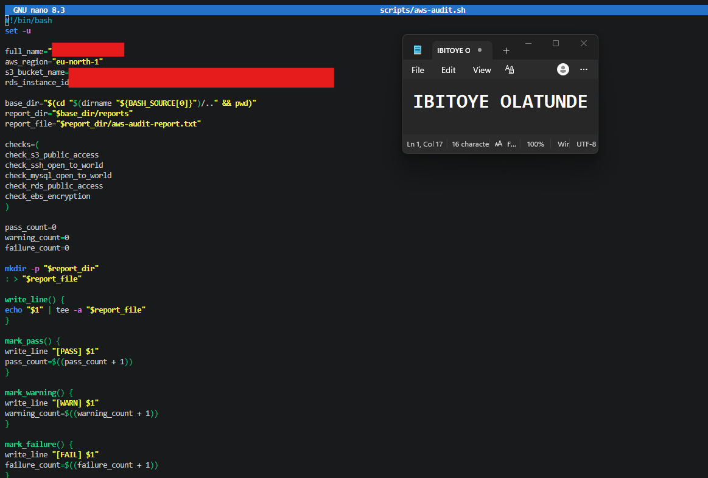

---

#### Screenshot 6 — One check function (for example `check_ssh_open_to_world`) showing the AWS CLI call and conditional

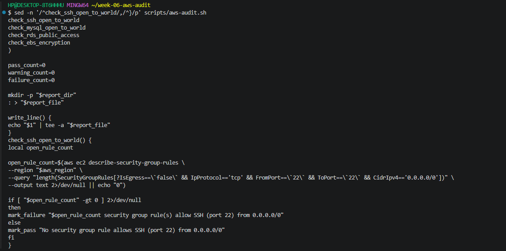

---

#### Screenshot 7 — Output of `bash -n scripts/aws-audit.sh` and `ls -l scripts/aws-audit.sh`

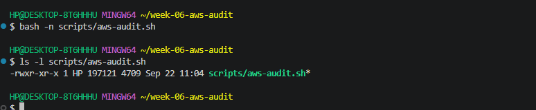

---

### Notes You Must Write (Very Important)

**1. What is stored in the checks array, and how does the loop use it?**

The checks array holds the names of the five check functions (check_s3_public_access, check_ssh_open_to_world, etc.) as strings. The for check_function in "${checks[@]}" loop iterates over that list and calls each function by name ("$check_function"), running all five checks in sequence without needing five separate hardcoded function calls.

**2. Why does every AWS CLI call in this script use `--query` and `--output text` instead of parsing raw JSON?**

--query uses JMESPath to extract exactly the single value or count needed (e.g., just PubliclyAccessible, or a count of matching rules) directly from AWS's response, and --output text returns that as a plain string. This avoids needing a separate JSON parser like jq inside the Bash script — the value comes back pre-filtered and ready to use directly in a Bash conditional (if [ "$value" = "True" ]).

**3. Why does the script use different exit codes for HEALTHY, WARN, and FAIL?**

Distinct exit codes (0, 1, 2) let the script's result be checked programmatically by anything that calls it — including the /aws-audit skill itself — without needing to parse the full text report just to know the overall severity. This follows standard Unix convention (0 = success) and lets automation branch on severity cheaply.

---

# Task 5 — Run the Baseline Audit

## Goal

Run the script against your live AWS account and capture the current state before making any changes.

### Evidence

#### Screenshot 8 — Output of `./scripts/aws-audit.sh` showing your Full Name and all five checks

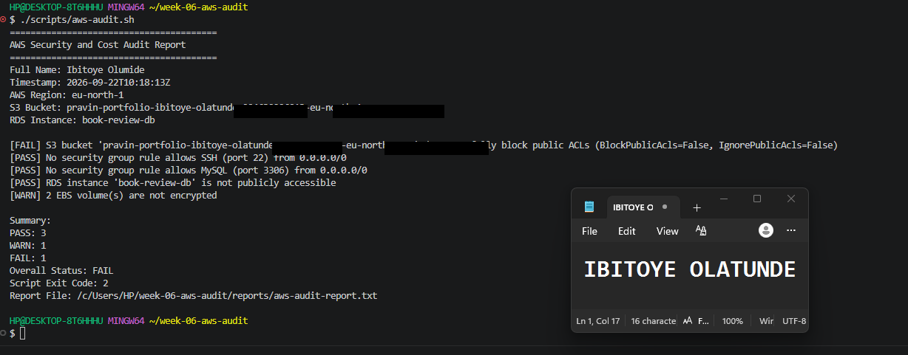

---

#### Screenshot 9 — Output showing the captured exit code and final summary

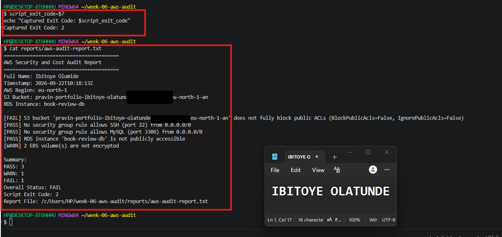

---

### Notes You Must Write (Very Important)

**1. What is the overall status of your baseline audit?**

Overall status: [FAIL]

**2. Did any check return FAIL or WARN? If so, which one, and what evidence did it show?**

[FAIL] S3 bucket 'pravin-portfolio-ibitoye-olatunde-904639296013-eu-north-1-an' does not fully block public ACLs (BlockPublicAcls=False, IgnorePublicAcls=False)
[WARN] 2 EBS volume(s) are not encrypted

**3. If every check passed, what does that tell you about the security posture of your account so far?**

If everything passed: "A fully passing baseline shows the account already follows reasonable defaults for this snapshot in time — no public S3 ACLs, no security groups open to the world on SSH/MySQL, RDS not publicly accessible, and all EBS volumes encrypted

---

# Task 6 — Build and Run the /aws-audit Skill

## Goal

Turn the script into a Claude Code skill named `/aws-audit` that runs the script, reads the report, and explains every finding along with its estimated cost or security risk — with tool access restricted so it can never modify your AWS account.

### Evidence

#### Screenshot 10 — `SKILL.md` showing the frontmatter, tool restrictions, and safety rules

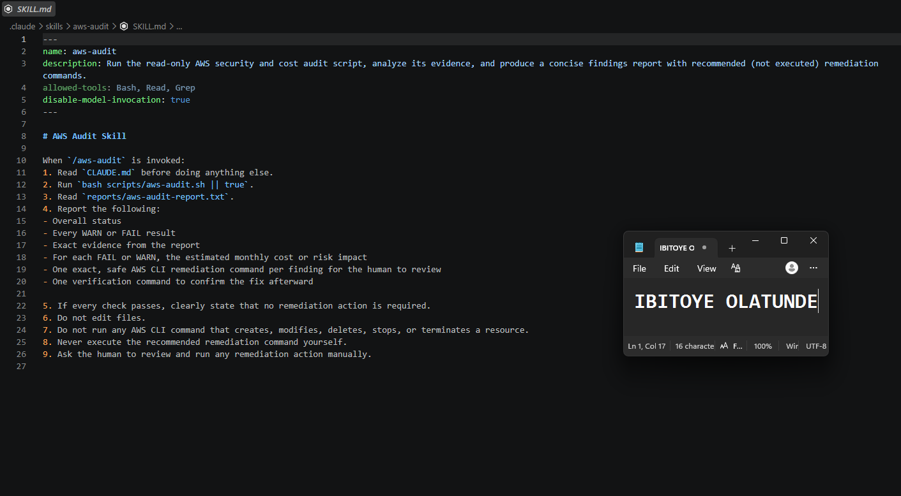

---

#### Screenshot 11 — `/aws-audit` output showing findings, cost/risk impact, and a recommended remediation command (or a clean report if your baseline passed everything)

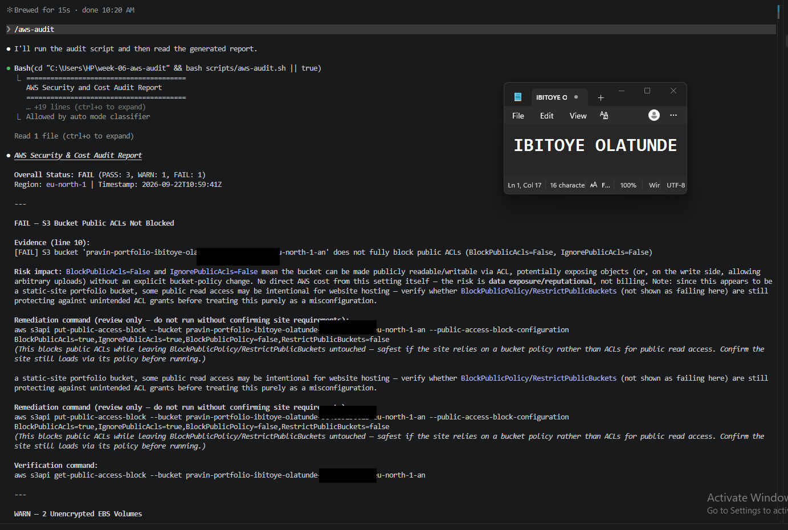

---

### Notes You Must Write (Very Important)

**1. Why does this skill have Bash, Read, and Grep, but not Write?**

The skill needs to run the audit script (Bash), read the resulting report (Read), and possibly search within it (Grep) — but it should never be able to create or modify any file, including the script itself or the report. Omitting Write access enforces the "read-only" promise structurally, at the tool-permission level, rather than just relying on a written instruction that Claude might not follow perfectly.

**2. What part is performed by Bash, and what part is performed by Claude?**

Bash performs the actual evidence gathering — running the real AWS CLI calls and writing PASS/WARN/FAIL lines to a static report file. Claude performs the analysis layer on top of that evidence: reading the report, explaining each finding in plain language, estimating cost/risk impact, and recommending (not running) a remediation command.

**3. Why is estimating cost/risk impact something the AI adds on top of a plain PASS/FAIL script?**

A Bash script can detect a binary condition (a rule matches a pattern, or it doesn't) but has no reasoning about what that condition actually means in dollar or risk terms — that requires judgment and context (e.g., "an SSH port open to the world is a brute-force attack vector," or "an unencrypted EBS volume costs nothing extra monthly but violates most compliance baselines"). That kind of interpretive reasoning is exactly what the AI layer adds on top of the script's raw pass/fail evidence.

---

# Task 7 — Fix a Real Finding and Re-Verify

## Goal

Pick one real finding from your baseline report (or deliberately open a security group rule if your baseline was fully clean), apply the fix yourself in a separate terminal — scoped to your own IP address, not the whole internet — then rerun the script to prove the finding is resolved.

### Evidence

#### Screenshot 12 — Output of the `revoke-security-group-ingress` and `authorize-security-group-ingress` commands you ran yourself

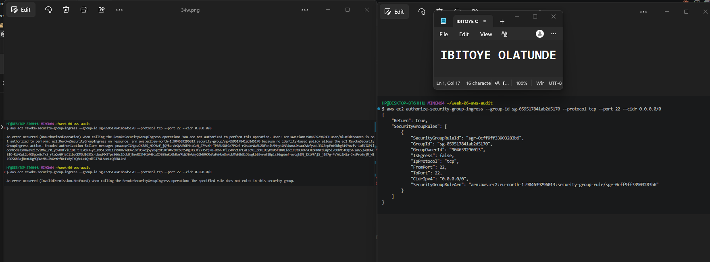

---

#### Screenshot 13 — Rerun of `./scripts/aws-audit.sh` showing the finding is now PASS

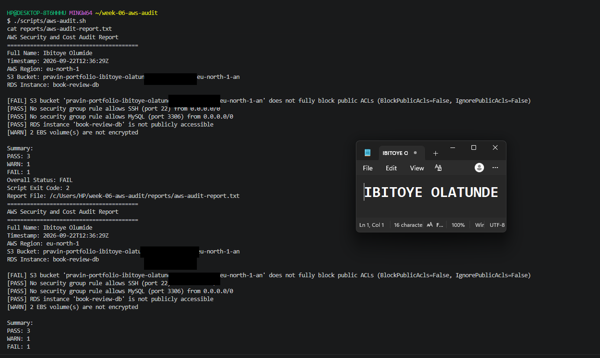

---

### Notes You Must Write (Very Important)

**1. Which exact finding did you fix, and what command did you run?**

I fixed the SSH-open-to-world finding. Since my account's SSH rule was already correctly scoped, I first deliberately opened it with aws ec2 authorize-security-group-ingress --group-id sg-059517841ab2d5170 --protocol tcp --port 22 --cidr 0.0.0.0/0 to create a genuine test condition, confirmed the audit caught it as [FAIL], then reverted it with aws ec2 revoke-security-group-ingress --group-id sg-059517841ab2d5170 --protocol tcp --port 22 --cidr 0.0.0.0/0, restoring the check to [PASS]

**2. Why did you scope the new rule to your own IP address instead of leaving it open to `0.0.0.0/0`?**

Scoping to a single /32 address means SSH can only be reached from that one specific IP, rather than from anyone on the internet, this follows least privilege: granting exactly the access needed and nothing more, which dramatically shrinks the attack surface for brute-force or credential-stuffing attempts.

**3. Did Claude execute the remediation command, or did you? Why does that matter?**

I executed both commands myself, directly in the terminal, after reasoning through the fix. This keeps a human explicitly accountable for every state-changing action against the live AWS account, the AI's role stays confined to analysis and recommendation, never execution, which is the entire safety model this assignment is built around.

**4. Which phase of the Agentic Loop does the Bash script represent? Which phase does Claude's explanation represent? Which phase is you running the fix?**

The Bash script = Gather (evidence collection via read-only calls). Claude's explanation of the report = Analyze (interpreting evidence, estimating impact, recommending a specific command). Me running the actual revoke/authorize commands = Act (human-approved, human-executed remediation). 
Rerunning the script afterward = Verify, closing the loop by confirming the fix actually took effect.

---

# LinkedIn Post (Required)

## Goal

Create a LinkedIn post including:

- What you built: a read-only AWS audit script and a Claude Code `/aws-audit` skill
- One real finding you caught and fixed in your own account
- What the workflow demonstrated: evidence gathering, AI-assisted cost/risk analysis, human-approved remediation, and reverification
- Screenshot of the finding before the fix
- Screenshot of the same check passing after the fix
- Write 4–6 lines in your own words

Suggested tags:

`#DMIByPravinMishra #AWS #AgenticAI #ClaudeCode #DevOps`

### Evidence

#### LinkedIn Post URL

Paste your LinkedIn post URL here:

`https://lnkd.in/p/eUPebMkV`

---

#### Screenshot of Published LinkedIn Post

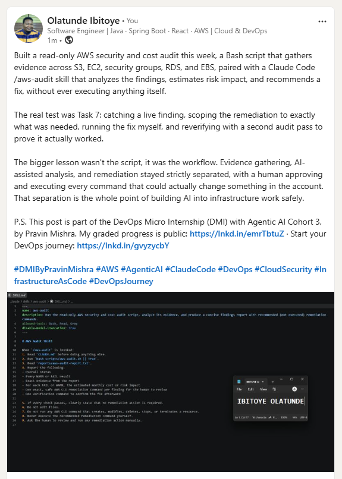

---

# Submission Instructions

Complete all tasks in sequence.

Your submission must include:

- All 13 required task screenshots
- Answers to every **Notes You Must Write** question
- `CLAUDE.md`
- `scripts/aws-audit.sh`
- `.claude/skills/aws-audit/SKILL.md`
- `reports/aws-audit-report.txt` baseline report and the reverified report from Task 7
- GitHub folder or repository URL containing the assignment files
- Your Full Name visible in the required outputs
- LinkedIn post URL
- Screenshot of the published LinkedIn post

Submit only a Google Doc link.

Add the GitHub URL inside the Google Doc.

Follow the Assignment Submission Guidelines.

---

# Completion Checklist

- [x] Task 1: AWS resources confirmed and workspace created (Screenshots 1–2)
- [x] Task 2: `CLAUDE.md` created with project context and safety rules (Screenshot 3)
- [x] Task 3: Claude produced a read-only five-check audit plan before any script existed (Screenshot 4)
- [x] Task 4: `aws-audit.sh` built, executable, and passes `bash -n` (Screenshots 5–7)
- [x] Task 5: Baseline audit captured and saved with Full Name visible (Screenshots 8–9)
- [x] Task 6: `/aws-audit` skill loads and runs successfully with no Write permission (Screenshots 10–11)
- [x] Task 7: A real finding was fixed by you and reverified as PASS (Screenshots 12–13)
- [x] Skill never executed a remediation command
- [x] New security group rule is scoped to your own IP, not `0.0.0.0/0`
- [x] All 13 required task screenshots are included
- [x] All "Notes You Must Write" questions are answered in your own words
- [x] No AWS credentials or unblurred account IDs exposed
- [x] LinkedIn post published and URL submitted
- [ ] GitHub URL included in the Google Doc
- [ ] Google Doc is accessible
- [ ] Link tested in incognito mode

---

# Final Submission

Submit only your Google Doc link.

### Question

Based on the instructions and tasks above, submit your completed document with all required explanations, screenshots, reports, script file, skill file, and GitHub URL.

`Add your Google Doc link here`

---

## 📌 About DMI & CloudAdvisory

DevOps Micro Internship (DMI) is a project-based DevOps program run by Pravin Mishra (The CloudAdvisory) focused on real-world execution, systems thinking, and career readiness.

It helps learners build strong DevOps foundations with hands-on experience.

---

## 📌 Resources

- 🌐 DMI Official Website: https://dmi.pravinmishra.com?utm_source=github&utm_medium=readme  
- 🎓 University: https://university.pravinmishra.com?utm_source=github&utm_medium=readme  
- 💬 Discord Community: https://discord.pravinmishra.com?utm_source=github&utm_medium=readme  
- 📝 Blog: https://dmi.pravinmishra.com/blog?utm_source=github&utm_medium=readme  
- ▶️ YouTube Playlist: https://www.youtube.com/playlist?list=PLFeSNDtI4Cho  
- 🔗 Pravin Mishra (LinkedIn): https://www.linkedin.com/in/pravin-mishra-aws-trainer/  
- 🏢 CloudAdvisory (LinkedIn): https://www.linkedin.com/company/thecloudadvisory/

---

*This submission is part of DevOps Micro Internship (DMI) Cohort 3 — Agentic AI Track.*